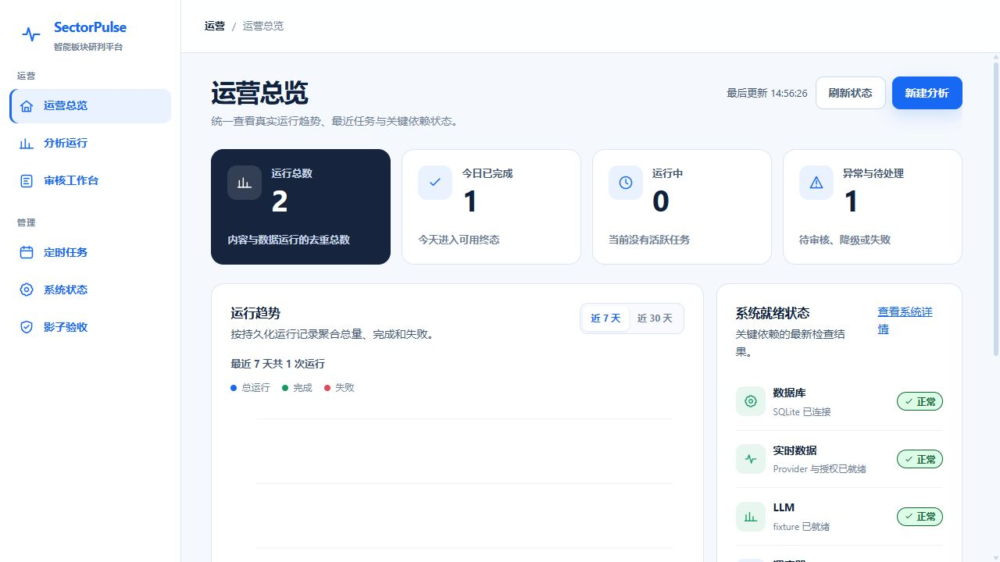
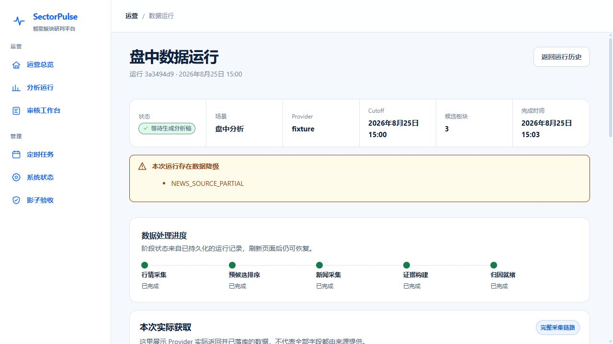
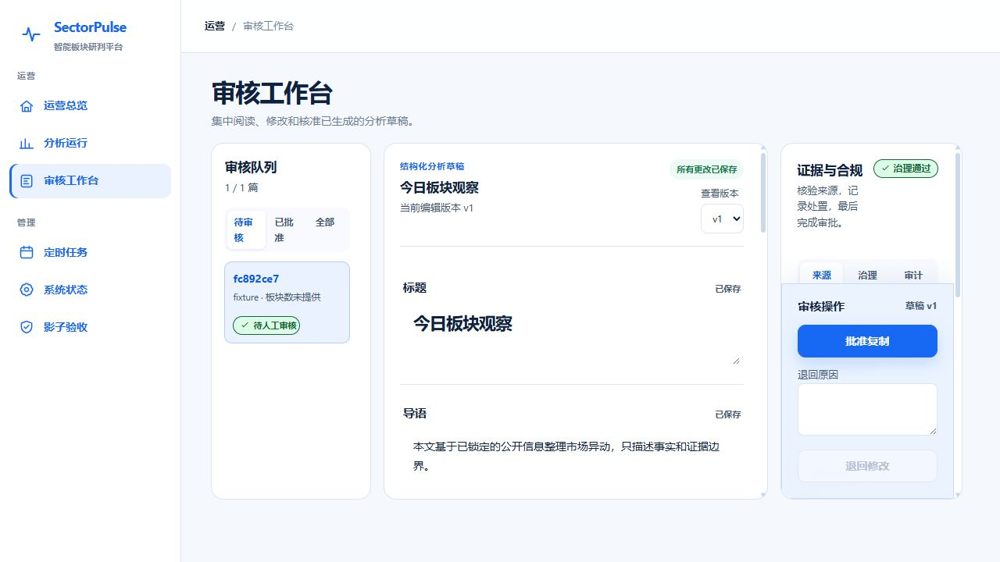

<div align="center">

# SectorPulse

**Evidence-first A-share sector analysis and review workspace.**

一个面向本地部署的 A 股板块分析工作台：从行情与新闻采集、候选板块筛选、证据归因，到 LLM 写作和人工审核，保留完整的数据与决策链路。


</div>



SectorPulse 不把模型生成的结论当作终点。它将市场快照、新闻记录、候选板块、引用证据、草稿版本和审核动作持久化，让一次分析为什么产生、使用了什么信息、经过了哪些修改都可以回看。

> [!IMPORTANT]
> SectorPulse 是分析与审核工具，不构成投资建议，不会自动发布内容或执行交易。

## 核心能力

- **真实数据工作流**：采集 A 股行业/概念板块行情与新闻，并记录 Provider、时间截点、原始响应摘要和数据质量。
- **候选板块筛选**：根据行情、新闻和质量规则生成排序候选；写作前可手动选择 3–12 个板块。
- **证据优先归因**：将新闻事件、来源、板块映射和归因门禁组织成可检查的证据链。
- **分阶段 LLM 写作**：支持 OpenAI-compatible 接口，覆盖归因、编辑、写作、审核与有限轮次修订。
- **人工审核工作台**：编辑草稿、管理版本、记录证据决定、批准、退回和导出，不自动对外发布。
- **可恢复运行**：任务、阶段进度、失败原因与审核结果持久化；支持定时任务、重试和运行状态查看。
- **双数据库运行时**：默认 SQLite，也可切换 PostgreSQL；配置 PostgreSQL 后不会静默回退到 SQLite。
- **Fixture-first**：不访问实时数据、不消耗真实 LLM 额度，也能完成前后端演练和回归测试。

## 工作流程


## 快速开始

### 环境要求

| 组件 | 版本或用途 |
| --- | --- |
| Python | 3.12+ |
| Node.js | 22.22.2+（22.x）或 24.15.0+（24.x）；完整支持范围见 `web/package.json` |
| PostgreSQL | 16，可选 |
| Docker Desktop | 仅容器部署需要 |

项目默认使用仓库根目录的 `.venv`，不需要额外创建 Conda 环境。

### 1. 获取代码并安装依赖

以下命令适用于 Windows PowerShell：

```powershell
git clone https://github.com/zrhm666/SectorPulse.git
Set-Location SectorPulse

Copy-Item .env.example .env
py -3.12 -m venv .venv
.\.venv\Scripts\python.exe -m pip install --upgrade "pip>=26.2"
.\.venv\Scripts\python.exe -m pip install -e ".[dev,postgres]"

Set-Location web
npm.cmd ci
Set-Location ..
```

### 2. 构建前端并启动

```powershell
Set-Location web
npm.cmd run build
Set-Location ..

.\.venv\Scripts\python.exe -m sector_pulse.web.server
```

打开 <http://127.0.0.1:9000>。FastAPI 会同时提供 API 和已经构建的 React 前端，并在启动时初始化当前数据库所需表结构。

### 3. 完成第一次分析

1. 进入“新建分析”，先选择业务场景；盘中 / 盘后参数只用于 Live 数据运行。
2. 选择执行方式；首次使用建议选择 **Fixture 演练**，它会运行固定内容样例。
3. 在参数确认页核对系统真正会提交的参数。
4. 确认启动后，查看运行详情、生成的分析稿和审核工作台。

Fixture 使用仓库内的可复现样例，不调用真实数据源，也不消耗 LLM 额度。

## 产品界面

### 数据运行工作台

查看采集来源、行情板块、新闻记录、质量报告和候选结果，并在写作前选择分析板块。



上图来自隔离的确定性 Fixture 验收库，用于展示当前生产构建如何呈现已持久化的采集、质量和候选数据；不会调用实时 Provider。

### 审核工作台

在同一页面编辑草稿、检查引用来源、记录证据决定，并执行批准或退回。



上图来自当前生产构建的 Fixture 内容运行，展示真实可用的版本、编辑、治理和审核界面。

## Live 实时运行

Live 模式会访问外部数据源并调用真实 LLM。除 `.env` 配置外，它还需要两个本机 consent 文件，避免误触发网络访问或额度消耗。

### 配置 LLM

编辑根目录 `.env`：

```dotenv
SECTOR_PULSE_LLM_PROVIDER=openai-compatible
SECTOR_PULSE_LLM_BASE_URL=https://your-provider.example/v1
SECTOR_PULSE_LLM_API_KEY=your-api-key
SECTOR_PULSE_LLM_MODEL=your-model
SECTOR_PULSE_LLM_TIMEOUT_SECONDS=60
SECTOR_PULSE_LLM_BUDGET_CNY=2.00
```

`SECTOR_PULSE_LLM_BASE_URL` 应填写 OpenAI-compatible API 的基础地址。API Key 只保存在本机 `.env`，不要提交到 Git。

### 创建授权文件

确认接受数据源条款和真实 LLM 调用成本后，在仓库根目录执行：

```powershell
New-Item .live-data-consent -ItemType File -Force
New-Item .live-llm-consent -ItemType File -Force
```

这些文件只代表当前机器上的明确授权，并已被 Git 忽略。启动 Live 分析前，可在“系统状态”页检查数据库、数据源、模型配置和 consent 是否就绪。

## 运行方式

### 本地生产模式

推荐用于日常使用。先构建前端，再由一个 FastAPI 进程提供页面和 API：

```powershell
Set-Location web
npm.cmd run build
Set-Location ..
.\.venv\Scripts\python.exe -m sector_pulse.web.server
```

访问 <http://127.0.0.1:9000>。

### 前后端开发模式

终端 1，启动后端：

```powershell
.\.venv\Scripts\python.exe -m sector_pulse.web.server
```

终端 2，启动前端热更新：

```powershell
Set-Location web
npm.cmd run dev
```

访问 Vite 输出的地址，通常是 <http://127.0.0.1:5173>。开发服务器会将 `/api` 代理到 `127.0.0.1:9000`。

开发和预览服务器默认只绑定 `127.0.0.1`，不要将它们作为公网服务。更新代码后使用 `npm.cmd ci` 安装锁文件中的版本，再重新构建；日常使用可直接运行后端提供的 `web/dist`。

### Docker Compose

SQLite：

```powershell
Copy-Item .env.example .env
docker compose up --build -d sector-pulse
```

访问 <http://127.0.0.1:8010>。

PostgreSQL：

```powershell
Copy-Item .env.example .env
docker compose --profile postgres up --build -d sector-pulse-postgres
```

访问 <http://127.0.0.1:8011>。Compose 会同时启动 PostgreSQL 16，并使用持久化 volume 保存数据。

基础容器配置用于 Fixture 演练。启用实时采集和 LLM 时，先按“授权文件”说明确认使用上游数据和模型额度，在宿主机创建两个授权文件，再显式加载 Live 覆盖文件：

```powershell
docker compose -f docker-compose.yml -f docker-compose.live.yml up --build -d sector-pulse
# PostgreSQL 部署使用：
docker compose -f docker-compose.yml -f docker-compose.live.yml --profile postgres up --build -d sector-pulse-postgres
```

覆盖文件只读挂载 `.live-data-consent` 和 `.live-llm-consent`；缺失文件会阻止启动，不会自动创建授权。SQLite 容器显式清空数据库 URL，避免误用宿主机 PostgreSQL 配置。

## 数据库

### SQLite（默认）

适合单机体验和开发。保持 `.env` 中数据库 URL 为空：

```dotenv
SECTOR_PULSE_DATABASE_PATH=data/sector-pulse.db
SECTOR_PULSE_DATABASE_URL=
```

### PostgreSQL

适合长期运行和更严格的持久化需求。先创建数据库和用户，再配置：

**本机已安装 PostgreSQL 时，无需 Docker。** 使用根目录 `.venv` 运行后端，连接本机数据库即可；前端构建后由后端一起提供。Docker Compose 只是可选部署方式。

```dotenv
SECTOR_PULSE_DATABASE_URL=postgresql+psycopg://用户名:密码@127.0.0.1:5432/数据库名
```

设置 `SECTOR_PULSE_DATABASE_URL` 后 PostgreSQL 优先于 SQLite。连接或迁移失败会终止启动，避免数据被意外写入另一个数据库。
运行时统一使用同步 psycopg 驱动；已有的 `postgresql+asyncpg://` 配置会自动规范化为 psycopg URL，便于旧环境平滑升级。

升级或迁移前，请先备份目标数据库。下面的命令不会修改数据库，密码可通过 PostgreSQL 的密码文件或临时 `PGPASSWORD` 环境变量提供：

```powershell
$backupFile = "data/backups/sectorpulse-$(Get-Date -Format 'yyyyMMdd-HHmmss').dump"
New-Item (Split-Path $backupFile) -ItemType Directory -Force | Out-Null
pg_dump -h 127.0.0.1 -U 用户名 -d 数据库名 --format=custom --file=$backupFile
```

应用启动时只执行尚未应用的前向迁移，不会自动删除、截断或重置现有数据。当前最新迁移版本为 `018_content_retry_lineage`。

### 取消与异常恢复

- 取消请求会先持久化，再由执行器在安全检查点停止任务。
- 服务重启时，遗留的运行中任务会被标记为 `INTERRUPTED`，不会伪装成仍在执行。
- 手动和定时分析共用同一执行路径；某个定时任务失败不会阻止其他到期任务继续推进。
- 调度器持久化上次消费窗口，重启后不会重复消费已经处理的到期窗口。
- 关闭自动调度只停止新到期任务的派发；已手动触发任务仍会推进，并同步采集、写作的最终结果。
- 单轮调度异常会降级并在下一轮重试，系统状态反映实际循环健康状态。
- 数据与内容重试均新建运行，通过 `retry_of_run_id` 保留来源，原记录和输入不变。

## 技术架构

| 层级 | 实现 |
| --- | --- |
| Web UI | React 18、TypeScript、Vite |
| API | FastAPI、Pydantic、Uvicorn |
| 数据与任务 | SQLite / PostgreSQL、嵌入式调度器 |
| 市场与新闻 | AkShare 适配器、RSS/新闻 Provider、可降级 Provider 链 |
| LLM | Fixture Provider、OpenAI-compatible Provider、阶段路由与预算限制 |
| 质量保障 | Pytest、Vitest、Playwright、Ruff |

核心原则：

- **Cutoff 可追踪**：每次运行锁定数据时间边界。
- **Evidence before prose**：先形成证据与归因，再进入写作。
- **Human in the loop**：机器生成内容必须经过人工审核。
- **Failure is visible**：数据降级、超时、限流和失败原因进入运行记录。
- **Local-first**：默认监听 `127.0.0.1`，敏感配置留在本机。

## 项目结构

```text
SectorPulse/
├─ backend/
│  ├─ src/sector_pulse/
│  │  ├─ application/      # 分析、归因、任务与审核用例
│  │  ├─ domain/           # 领域模型与规则
│  │  ├─ infrastructure/   # 数据源与 LLM Provider
│  │  ├─ storage/          # SQLite/PostgreSQL 仓储与迁移
│  │  └─ web/              # FastAPI 接口与服务入口
│  └─ tests/               # 单元、集成、端到端与 Live 测试
├─ config/                 # LLM、新闻源、实体和 Prompt 配置
├─ docs/                   # 设计、计划、验收与项目审查记录
├─ plugins/                # 可选 Provider 清单
├─ scripts/                # 验证、备份与恢复脚本
└─ web/                    # React 运营后台
```

## 主要页面

| 路径 | 用途 |
| --- | --- |
| `/` | 运营总览与运行条件 |
| `/runs/new` | 新建 Fixture 或 Live 分析 |
| `/runs` | 分析运行历史 |
| `/data-runs/:runId` | 实时数据采集与候选板块工作台 |
| `/runs/:runId` | 内容运行、草稿与治理结果 |
| `/review` | 人工审核队列和草稿编辑 |
| `/schedules` | 定时任务管理 |
| `/system` | 脱敏系统状态 |
| `/shadow-acceptance` | 历史影子验收记录（当前暂停） |

## 测试与质量检查

推荐从仓库根目录运行完整 Stage 0 门禁：

```powershell
# 首次运行浏览器测试时安装 Chromium
Set-Location web
npx.cmd playwright install chromium
Set-Location ..
powershell -ExecutionPolicy Bypass -File scripts/verify-stage0.ps1
```

该命令依次执行 Ruff、严格 Mypy、Python 依赖审计、非 Live 后端测试、前端工具链边界测试、前端单测、生产构建、真实 SQLite HTTP 流程、生产及开发模式 Playwright、依赖树检查和包含开发依赖的全量 npm 安全审计。测试子进程强制使用 Fixture/SQLite，不继承业务 PostgreSQL 连接，不会访问 Live 数据源或调用真实 LLM。PostgreSQL 合约测试由 CI 的隔离 PostgreSQL 16 服务执行；本机执行时必须明确指向专用测试库。

后端：

```powershell
.\.venv\Scripts\python.exe -m pytest backend/tests -q
.\.venv\Scripts\python.exe -m ruff check backend/src backend/tests
```

前端：

```powershell
Set-Location web
npm.cmd run test:tooling
npm.cmd test
npm.cmd run build
npm.cmd run test:e2e
npm.cmd run test:e2e:dev
npm.cmd ls --all
npm.cmd audit
```

Live 测试默认跳过，只有在显式提供 consent、配置和 pytest 参数时才会访问外部服务。PostgreSQL 集成测试需要 `SECTOR_PULSE_DATABASE_URL` 已进入当前进程环境。

## 文档

- [项目当前进度与未完成边界](docs/PROJECT_STATUS.md)
- [产品定义](PRODUCT.md)
- [UI 设计系统](docs/design/soft-blue-operations-ui-system.md)
- [完整项目审查](docs/superpowers/reports/2026-08-23-full-project-review.md)
- [实现计划与设计记录](docs/superpowers/)
- [Stage 0 可靠性验收](docs/superpowers/acceptance/2026-08-30-stage0-reliability-foundation.md)
- [2026-09-05 收尾设计](docs/superpowers/specs/2026-09-05-reliability-closeout-design.md)
- [2026-09-05 收尾计划](docs/superpowers/plans/2026-09-05-reliability-closeout.md)
- [2026-09-05 可靠性验收](docs/superpowers/acceptance/2026-09-05-reliability-closeout.md)
- [2026-09-06 本机业务 PostgreSQL 升级验收](docs/superpowers/acceptance/2026-09-06-business-postgresql-upgrade.md)
- [2026-09-06 前端工具链升级设计](docs/superpowers/specs/2026-09-06-web-toolchain-security-design.md)
- [2026-09-06 前端工具链升级计划](docs/superpowers/plans/2026-09-06-web-toolchain-security.md)
- [2026-09-06 前端工具链与开发模式验收](docs/superpowers/acceptance/2026-09-06-web-toolchain-security.md)

## 当前边界

- 项目面向单用户、本机或受控环境部署，尚未提供账号、权限与多租户体系。
- 数据源可用性受上游接口、网络状况和各 Provider 使用条款影响。
- 新闻摘要和公开链接的完整度取决于上游来源；审核时应打开原文核对关键事实。
- LLM 输出可能超时、限流或产生错误，系统会记录失败，但不能替代人工判断。
- 批准动作只开放复制和导出，不会自动发布文章，也不会产生交易指令。

## License

本项目采用 [MIT License](LICENSE)。
