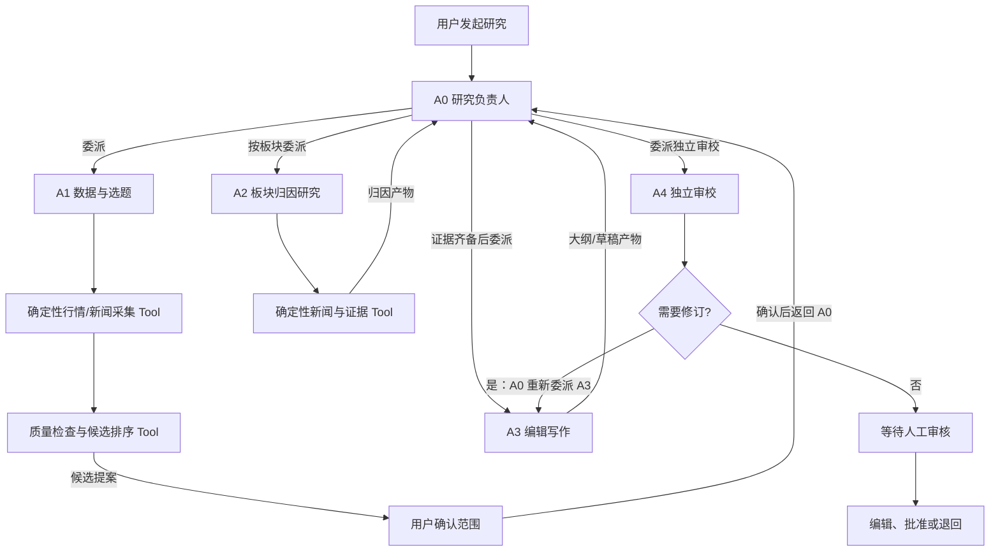

<div align="center">

# SectorPulse

**Evidence-first A-share sector research and review workspace.**

一个本地优先的 A 股板块研究工作台：从行情与新闻，到板块归因、研究写作和人工审核，保留完整、可回看的证据链。


</div>


> [!IMPORTANT]
> SectorPulse 是研究与审核工具，不构成投资建议，不自动发布内容，也不执行交易。

## 为什么是 SectorPulse？

SectorPulse 不只生成一篇文章。它会保存行情快照、新闻来源、候选板块、证据归因、草稿版本和人工审核动作，让你能够回看：

- 结论来自哪些数据和来源？
- 哪些证据支持或削弱了这次归因？
- 草稿经过了哪些 Agent 和人工修改？
- 当前结果是否已经通过人工审核？

## 核心能力

- **证据优先**：先采集、核验和归因，再进入写作。
- **父子 Agent 协作**：一个 A0 研究负责人调度 A1–A4 专业 Agent。
- **受控 Skill**：为选题、证据研究、写作和审校提供方法指导。
- **人工把关**：模型不能代替用户选择板块、编辑、批准或撤销。
- **可恢复运行**：任务进度、失败原因、草稿版本和运行状态可追踪。
- **本地优先**：默认 SQLite，也支持 PostgreSQL；Fixture 模式无需联网即可体验。

## 工作方式



A0 负责拆解目标和委派任务；A1–A4 负责各自专业阶段。采集、评分、证据校验、预算和数据库操作由受控 Tool 或基础服务执行。

### Agent 角色

| Agent | 负责什么 | 主要产出 |
| --- | --- | --- |
| **A0 研究负责人** | 理解研究目标，安排任务并汇总阶段结果 | 一棵可追踪的研究任务树 |
| **A1 数据与选题** | 编排并调用行情/新闻采集工具，检查数据质量，提出候选板块 | 候选板块提案 |
| **A2 板块归因研究** | 针对每个板块核验新闻和证据，分析上涨或变化原因 | 板块归因分析与证据引用 |
| **A3 编辑写作** | 根据已核验的研究结果组织结构并撰写分析稿 | 大纲、草稿和受控修订稿 |
| **A4 独立审校** | 独立检查事实、来源、证据和表达质量 | 审校意见与通过/修订建议 |

A0 会根据阶段结果继续委派下一步任务；A2 可以按板块并行研究。行情、新闻、评分和质量检查由确定性 Tool/Provider 执行，A1 负责编排调用并解释结果。A4 通过后仍需人工编辑和审核，系统不会自动发布内容。

### 受控 Skill

Skill 是只读的方法库，不是权限系统。当前方法包括：

- `data-gap-handling`、`sector-selection`：数据缺口与板块选题
- `causal-evidence`、`news-verification`：因果证据与新闻核验
- `analysis-writing`：分析写作
- `independent-review`：独立审校

Skill 按角色白名单加载，不能访问任意文件、数据库或审批能力。

## 快速开始

### 环境

- Python 3.12+
- Node.js 22+ 或 24+
- PostgreSQL 16+（可选）

### 安装

```powershell
git clone https://github.com/zrhm666/SectorPulse.git
Set-Location SectorPulse
Copy-Item .env.example .env

py -3.12 -m venv .venv
.\.venv\Scripts\python.exe -m pip install -e ".[dev,postgres]"

Set-Location web
npm.cmd ci
npm.cmd run build
Set-Location ..
```

### 启动

```powershell
.\.venv\Scripts\python.exe -m sector_pulse.web.server
```

打开 <http://127.0.0.1:9000>，创建一次 **Fixture 演练**即可开始。Fixture 使用本地样例和临时 SQLite，不访问实时数据，也不消耗真实模型额度。

## 使用真实数据和模型

在 `.env` 中配置 OpenAI-compatible LLM：

```dotenv
SECTOR_PULSE_LLM_PROVIDER=openai-compatible
SECTOR_PULSE_LLM_BASE_URL=https://your-provider.example/v1
SECTOR_PULSE_LLM_API_KEY=your-api-key
SECTOR_PULSE_LLM_MODEL=your-model
```

确认接受外部数据和模型费用后，在仓库根目录创建授权文件：

```powershell
New-Item .live-data-consent -ItemType File -Force
New-Item .live-llm-consent -ItemType File -Force
```

没有授权文件时，系统不会启动相应的外部调用。API Key 只保存在本机 `.env`，不要提交到 Git。

## 数据来源

### 行情与板块

Live 模式默认通过 AkShare 读取 A 股板块行情和板块成分信息，内置支持东方财富和同花顺口径的板块数据适配。Fixture 模式使用本地可复现样例，不访问网络。

### 新闻

新闻来源按 [`config/news_sources.yaml`](config/news_sources.yaml) 管理，当前内置适配包括：

- 财联社（CLS）快讯
- 东方财富新闻
- 巨潮资讯（CNINFO）公告与披露
- 配置化 RSS 来源

系统会记录来源、抓取时间、数据质量和使用的时间边界。新闻原文不可得时会明确标记，不会把缺失内容伪装成已核验事实。

### 可插拔 Provider

行情和新闻都通过统一的 Provider 接口接入。你可以新增自己的数据源适配器，完成字段映射和质量报告后，在运行时 Provider 装配中替换默认实现；上层的候选筛选、证据归因、Agent 和数据库流程无需改动。Provider 也可以通过插件注册机制接入，具体开发约定见 [后端维护指南](backend/README.md)。

## 可插拔组件

SectorPulse 把外部依赖与研究流程分开，替换 Provider 不需要重写 A0–A4 的协作逻辑。

| 组件 | 内置选项 | 适合替换的场景 |
| --- | --- | --- |
| **LLM Provider** | Fixture 模型、OpenAI-compatible 接口 | 切换 DeepSeek、OpenAI 或其他兼容接口；离线演练时使用 Fixture |
| **行情 Provider** | AkShare 东方财富、AkShare 同花顺 | 接入其他行情 API、内部行情服务或自建数据快照 |
| **新闻 Provider** | 财联社、东方财富、巨潮资讯、RSS | 增加行业媒体、公告源、研究机构 RSS 或内部新闻服务 |
| **数据库** | SQLite、PostgreSQL | 单机体验使用 SQLite；长期运行或多人共享时使用 PostgreSQL |
| **Provider 插件** | 配置化 Provider 注册机制 | 将自定义 Provider 作为独立插件装配，和主程序解耦 |

LLM 只负责研究、写作和审校中的语言推理；行情、新闻和数据库 Provider 必须遵守统一的数据契约，系统会继续执行来源、时间边界、质量和权限校验。这样可以更换数据供应商或模型，而不改变任务树、Skill、人工审核和证据链。

## 数据库

默认使用 SQLite：

```dotenv
SECTOR_PULSE_DATABASE_PATH=data/sector-pulse.db
SECTOR_PULSE_DATABASE_URL=
```

切换 PostgreSQL 时设置：

```dotenv
SECTOR_PULSE_DATABASE_URL=postgresql+psycopg://用户名:密码@127.0.0.1:5432/数据库名
```

应用不会在 PostgreSQL 连接失败时静默回退到 SQLite。

## 项目结构

```text
backend/src/sector_pulse/   后端、编排和业务 Tool
config/prompts/             A0–A4 提示词
config/agent-skills/        受控 Skill 方法库
vendor/aidynamic-agent/      内置 Agent 框架
web/                        React 前端
docs/                       设计与使用文档
```

## 进一步了解

- [产品定义](PRODUCT.md)
- [项目当前状态](docs/PROJECT_STATUS.md)
- [功能迁移说明](docs/superpowers/specs/2026-09-13-feature-migration-map.md)
- [多 Agent 架构设计](docs/superpowers/specs/2026-09-12-multi-agent-platform-design.md)
- [后端维护指南](backend/README.md)

## License

本项目采用 [MIT License](LICENSE)。
