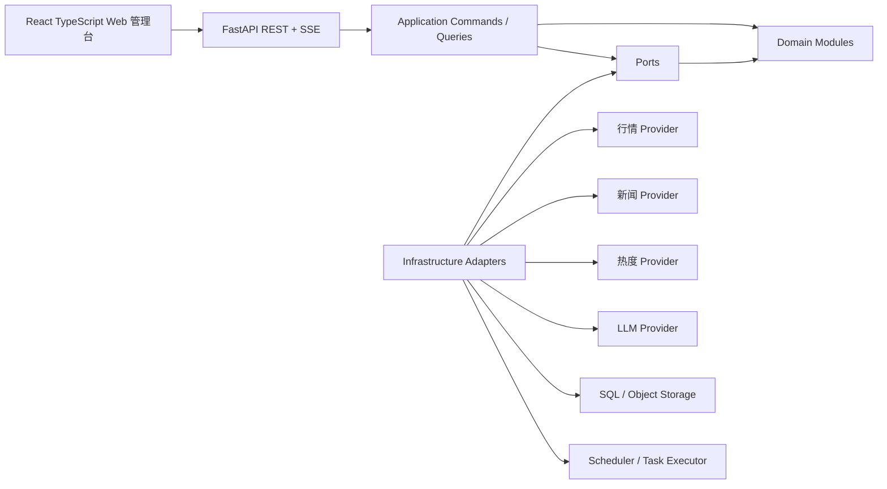
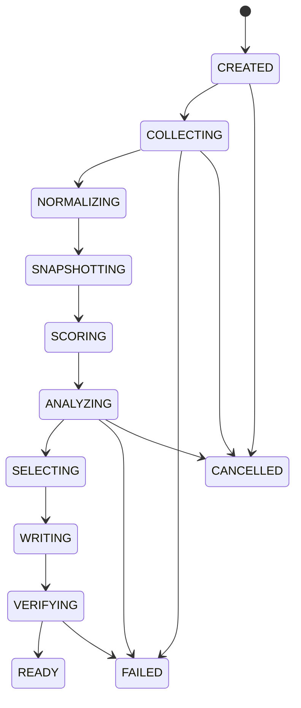
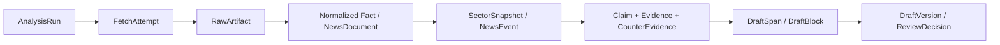

# A 股板块分析文案助手——总体设计规格

> 状态：已完成逐节讨论，等待用户审阅正式文档
>
> 日期：2026-08-13
>
> 市场范围：A 股行业板块与概念板块
>
> 产品形态：单用户、自托管 Web 管理台
>
> 输出边界：生成一篇通用社区草稿，由用户审核、修改、复制并手动发布

## 1. 执行摘要

本系统每天约执行两次，也支持用户自定义定时和随时手动运行。每次任务在明确的数据截止时间上冻结行情、新闻与热度数据，对 A 股全部行业板块和概念板块做程序化扫描，从中召回 8～12 个候选，再使用有边界的 Agent 并行完成新闻关联与证据归因，最终精选 3～6 个重点板块，生成一篇约 1000～1800 字的通用社区稿。

系统采用“模块化单体 + 有界多 Agent + 可插拔 Provider”架构：

- 全市场事实计算、热度评分、时点校验和来源渲染由确定性程序完成。
- Agent 只负责新闻语义匹配、谨慎归因、选题编辑、社区化表达和语义复核。
- 行情、新闻、热度、LLM、存储、任务执行等外部能力通过 Port/Adapter 接入。
- 第一版保持一个低运维成本的部署单元；未来出现真实瓶颈时，再沿既有 Port 拆分服务。
- “暂无可靠解释”“部分成功”“今天不生成可发布稿”都是合法结果，不允许为了完整度编造因果。

选择该方案的原因是：它比单脚本更可追溯、比自由 Agent 群聊更稳定、比微服务平台更符合每天约两次和单用户的实际规模。

## 2. 已确认的产品目标

### 2.1 核心目标

1. 扫描 A 股全市场行业板块与概念板块。
2. 发现涨跌突出、交易活跃、散户关注高、新闻密集或异动明显的板块。
3. 解释板块走势与新闻之间可能存在的关系，但允许拒绝归因。
4. 生成专业、清晰、有数据、有热点感、适合非专业交易者阅读的通用社区稿。
5. 让用户能够在 5 分钟内完成事实核验、证据处理、文案修改和终稿复制。
6. 对每个数字、新闻、归因、模型结果和人工修改保留可追溯记录。
7. 开发期使用低成本数据源，同时保留切换正式授权行情与新闻服务的能力。
8. 将正常模型费用控制在每月约 50 元，100 元作为硬上限；数据授权费用单列。

### 2.2 输出要求

- 每轮只生成一篇通用稿，不做雪球版、支付宝版等平台专属稿。
- 稿件面向雪球、支付宝基金/理财社区及类似内容平台，由用户自行复制发布；系统不接入平台账号或发布 API。
- 正文约 1000～1800 字，通常选择 3～6 个重点板块。
- 偏向散户关注度高、交易热度高、新闻较多的方向，同时保留承压或分化板块的表达空间。
- 正文使用简短来源标记，文末生成完整来源清单，包含标题、来源、发布时间和原始链接。
- 可以提及代表性、领涨或拖累个股，但只能用于解释板块结构。
- 不自动发布，用户自行复制并手动发布。

### 2.3 明确不做

- 不提供交易下单、模拟盘、组合管理或收益预测。
- 不给出买入、卖出、持有、加仓、减仓、仓位、目标价、止盈止损或买卖时机建议。
- 不提供个性化咨询、诊股、帮看票、会员群、付费私聊或导流。
- 不承诺收益，不使用“必涨、稳赚、最后上车、确定性机会”等表达。
- 不默认建设多租户、账单、复杂 RBAC、移动客户端或自动发布能力。
- 不默认部署 Redis、MongoDB、消息队列、向量数据库或微服务集群。
- 不把社区热度当作事实证据，不把新闻同时出现自动写成涨跌原因。

### 2.4 目标写作风格

- 专业但适合社区阅读：先给结论，再用数据和证据解释。
- 面向非专业交易者：必要术语附简短解释，不假设读者掌握量化或产业知识。
- 有热点感和情绪张力，但情绪必须来自真实的活跃度、扩散度和事件变化。
- 优先使用“升温、分化、承压、热度扩散、资金集中”等可核验表达。
- 避免喊单、收益暗示、绝对化预测和制造错过焦虑。

### 2.5 默认文章结构

1. 一个有吸引力但不夸大确定性的标题；
2. 简短市场概览，说明数据截止时间和当日整体情绪；
3. 3～6 个重点板块段落，每段包含走势事实、内部结构、新闻/事件及证据等级；
4. 对无法归因的板块明确写“暂无可靠解释”，相关新闻只作背景；
5. 克制的总结和风险提示，不给出次日涨跌预测；
6. 完整来源清单。

## 3. 用户日常工作流

### 3.1 触发方式

用户可以：

- 配置一个或多个盘中执行时间；
- 配置盘后执行时间；
- 随时手动执行；
- 为单次运行选择“经济模式”或“高质量模式”。

定时任务和手动任务必须调用同一个 `StartAnalysisRun` 应用命令，保证数据截止、任务状态、预算和审计行为一致。

同一天的多次运行各自形成独立版本，不能用后一次数据覆盖前一次任务。非交易时段或非交易日手动运行时，页面和稿件应标明“最近交易日复盘/更新”及实际截止时间，不得伪装成实时盘中分析。

### 3.2 一轮任务

1. 创建 `AnalysisRun`，锁定任务 ID、交易日、时区、运行模式和 `run_cutoff_at`。
2. 并行获取行情、成分股、新闻与可选热度数据。
3. 标准化数据并执行覆盖率、新鲜度、时点一致性和异常值检查。
4. 对行业与概念板块分别计算市场事实与“值得写”指标。
5. 通过多路召回得到 8～12 个候选，并对高度重叠概念做聚类去重。
6. 对候选板块并行执行证据匹配和谨慎归因。
7. 精选 3～6 个板块，构造文章主线和篇幅分配。
8. 生成通用社区稿。
9. 执行事实、时间、引用、归因和合规核验；只返工有问题的句段。
10. 将草稿与证据卡送入审核台。

### 3.3 五分钟审核路径

1. 约 30 秒：检查任务健康、截止时间、降级状态和红色告警。
2. 约 2 分钟：逐段核验 3～6 个重点板块的行情与新闻证据卡。
3. 约 1 分钟：保留、降级或驳回证据，并局部重写相关段落。
4. 约 1 分钟：运行全文数字、来源、归因与合规复检，查看修改差异。
5. 约 30 秒：核准终稿并复制；是否把修改采纳为长期偏好另行决定。

系统不记录用户是否真的在外部平台发布。

## 4. 业务架构

系统由九个业务能力模块构成。模块可以先在同一 Python 进程内运行，但禁止跨模块直接访问内部数据库表。

### 4.1 `market_intelligence`

职责：

- 维护行业/概念板块定义和分类版本。
- 标准化板块行情、历史基线和成分股数据。
- 计算板块涨跌、成交活跃度、上涨/下跌家数、涨停/异动、领涨与拖累股。
- 执行行情覆盖率、时点一致性和异常值检查。

不负责：新闻解释、选题文案或模型调用。

### 4.2 `news_intelligence`

职责：

- 采集官方公告、监管/部委信息、财经媒体和其他已配置来源。
- 保存发布时间、采集时间、原始 URL、来源机构、正文摘要与内容哈希。
- 将转载和改写聚类为同一个 `NewsEvent`，优先保留官方、一手或最早可信来源。
- 识别公司、行业、产业链和概念实体，为后续板块匹配提供候选。

不负责：认定新闻导致板块涨跌。

### 4.3 `sector_selection`

职责：

- 计算综合热度和异动指标。
- 通过多路召回生成候选板块池。
- 处理行业与概念板块的尺度差异、成分股重叠和主题同质化。
- 保存每个板块入选或落选的可解释原因。

不负责：对新闻做因果判断。

### 4.4 `evidence_attribution`

职责：

- 建立 `Claim`、`Evidence` 和 `CounterEvidence`。
- 依据来源质量、时间先后、板块特异性、市场印证和替代解释进行证据分级。
- 输出“明确驱动、可能催化、市场联想、暂无可靠解释”。
- 生成供审核台展示的判断依据和反证。

不负责：修改行情事实或编写整篇文章。

### 4.5 `content_studio`

职责：

- 根据精选板块生成文章提纲、标题、正文和风险提示。
- 绑定段落、主张、事实 ID 和证据 ID。
- 执行事实核验、引用核验、语义归因复核和合规检查。
- 支持对单个段落定点重写，而不是无条件重写全文。

### 4.6 `review_learning`

职责：

- 保存原稿、修改稿、段落差异、审核决策和终稿。
- 从人工修改中提出“候选偏好”。
- 只有用户明确采纳后，才生成新的长期写作偏好版本。
- 支持查看偏好来源、停用、回滚和版本比较。

偏好永远不能覆盖事实、证据、时点和合规规则。

### 4.7 `run_orchestration`

职责：

- 统一承接手动和定时触发。
- 维护显式、可持久化、可恢复的任务状态机。
- 控制并发、截止时间、重试、取消、检查点和部分成功。
- 发布领域事件供进度 UI、日志、成本和审计消费者使用。

该模块只能调用小型应用服务，不得演化成包含全部业务逻辑的 God Object。

### 4.8 `provider_platform`

职责：

- 注册和解析 Provider/插件。
- 执行能力协商、健康检查、优先级、熔断和降级。
- 管理 Provider Manifest、配置 Schema、API 版本和契约测试。
- 记录授权状态、商业使用、署名、留存和速率限制等信息。

### 4.9 `governance`

职责：

- 预算管理、模型使用记录与月度硬上限。
- Prompt、模型、Provider 和规则版本治理。
- 密钥、审计、数据留存、系统健康和备份策略。
- 管理合规禁语与发布门禁版本。

## 5. 总体技术架构

### 5.1 架构形式

采用模块化单体，建议 Monorepo 内包含：

- Python API/Worker；
- TypeScript Web 管理台；
- 共享 API 契约与生成客户端；
- 内置可信插件；
- Provider 契约测试、Prompt 回归集和端到端测试。



依赖规则：

- Domain 不依赖 FastAPI、SQLAlchemy、具体模型 SDK 或数据供应商 SDK。
- Application 依赖 Domain 和 Port 抽象。
- Infrastructure 实现 Port，并在程序启动时由依赖注入装配。
- Interface 层只处理协议、输入校验、身份边界、错误映射和事件推送。

这里的 Port 是“能力契约”，不是网络端口。例如 `MarketDataPort` 规定输入、输出、错误语义和时间要求；AKShare、Tushare 或未来授权行情服务分别作为 Adapter 实现它。

### 5.2 建议技术栈

后端：

- Python 3.12+；
- FastAPI；
- Pydantic v2 作为领域边界和 Agent 结构化输出契约；
- SQLAlchemy 2 + Alembic；
- `asyncio` 有界并发，`httpx` 作为 HTTP 客户端；
- Pandas/NumPy 用于第一阶段市场数据处理，但不把 DataFrame 暴露到模块公共契约；
- 嵌入式调度器作为 `SchedulerPort` 的第一实现；
- 结构化日志和 SSE 进度流。

前端：

- React + TypeScript + Vite；
- OpenAPI 生成 API Client；
- TanStack Query 管理服务器状态；
- 草稿以结构化 `DraftDocument` 区块为真实数据模型，编辑器只是 Adapter；
- 审核台支持全文视图、段落证据视图、Diff、局部重写和复制终稿。

不将 LangGraph、AutoGen、LiteLLM、Celery 或 Temporal 作为业务核心的强依赖。若后续确有价值，通过 `AgentGraphExecutor`、`LLMProvider` 或 `TaskExecutor` Adapter 接入。

### 5.3 建议目录

```text
apps/
  api/
  worker/
  web/
backend/
  modules/
    market_intelligence/
    news_intelligence/
    sector_selection/
    evidence_attribution/
    content_studio/
    review_learning/
    run_orchestration/
    provider_platform/
    governance/
  infrastructure/
  bootstrap/
packages/
  contracts/
  sdk/
plugins/
  providers/
  indicators/
  rules/
  templates/
tests/
  unit/
  contract/
  integration/
  prompt_eval/
  e2e/
  fixtures/
docs/
  superpowers/specs/
  adr/
  provider-matrix/
  operations/
```

## 6. 核心领域模型

### 6.1 运行与来源

- `AnalysisRun`：一次独立运行；包含交易日、模式、截止时间、状态和总体预算。
- `RunStageAttempt`：阶段的执行次数、输入指纹、状态、耗时、错误和检查点。
- `FetchAttempt`：对某个 Provider 能力的单次请求结果。
- `RawArtifact`：原始响应或网页内容的对象引用、内容哈希和留存策略。
- `ProviderManifest`：能力、版本、配置、授权、限流、数据新鲜度和兼容信息。

### 6.2 市场与新闻

- `SectorDefinition`：板块代码、名称、类型、分类体系、来源和版本。
- `SectorMembershipSnapshot`：某时点的板块成分股集合。
- `MarketObservation`：股票或板块的原始规范化观测。
- `SectorSnapshot`：某板块在本轮截止时间上的完整事实快照。
- `NewsDocument`：单篇原始新闻或公告的元数据与摘要。
- `NewsEvent`：一个事件及其多篇转载/改写文档。
- `HeatSignal`：成交、搜索、社区等热度信号及其可用性状态。

### 6.3 分析与成文

- `SelectionFeature`：某项选板指标的原始值、标准化值、权重和贡献。
- `SelectionDecision`：候选召回、聚类、精选或排除的决定与原因。
- `Claim`：准备写入文章的可验证主张。
- `Evidence`：支持主张的事实或事件。
- `CounterEvidence`：反证或替代解释。
- `SectorBrief`：单板块的结构化分析结果。
- `ArticleOutline`：文章主线、板块顺序和篇幅分配。
- `DraftDocument`：结构化文章区块、引用绑定和合规状态。
- `DraftVersion`：每次生成或人工编辑后的不可变版本。
- `ReviewDecision`：证据保留、降级、驳回和草稿核准操作。
- `PreferenceCandidate`：从一次或多次编辑中提出的候选偏好。
- `WritingPreference`：用户明确采纳的版本化偏好。

### 6.4 模型治理

- `PromptDefinition`：Prompt ID、版本、输入/输出 Schema、工具策略、语言策略和评测集。
- `AgentDefinition`：角色、模型路由、工具白名单、预算和失败策略。
- `ModelInvocation`：Provider、模型 ID、参数、Token、成本、缓存情况、请求和结果引用。
- `UsageLedger`：按运行、Agent、Provider、模型和月份聚合成本。

## 7. 任务状态机与失败语义

### 7.1 主状态



`DEGRADED` 和 `PARTIAL` 不是阻止流程继续的主阶段，而是独立的 `quality_status`：

- `NORMAL`：所有必需能力与主要可选能力正常；
- `DEGRADED`：缺少社区热度、备用新闻等可选能力，但核心事实和稿件仍可用；
- `PARTIAL`：个别候选板块失败或被排除，其余结果仍可成稿。

任何活动阶段遇到不可恢复的核心错误都可以进入 `FAILED`；图中只画出代表性分支，避免把每条失败边画满。

### 7.2 数据状态

任何 Provider 调用不得只返回值或 `None`，必须明确区分：

- `SUCCESS`：成功且有数据；
- `EMPTY`：成功查询，确实没有记录；
- `PARTIAL`：部分板块或字段缺失；
- `STALE`：只能使用上次成功缓存；
- `UNAVAILABLE`：当前 Provider 不支持该能力；
- `FAILED`：请求、解析或质量检查失败。

`FAILED` 不能被解释成“市场没有新闻”；模型失败也不能被解释成“暂无可靠解释”。

### 7.3 幂等与恢复

- 每个阶段使用 `run_id + stage + input_fingerprint + version` 作为幂等键。
- 成功阶段产生不可变检查点，重启后从最后一个有效检查点恢复。
- 重试创建新的 `RunStageAttempt`，不得覆盖原失败记录。
- 全局 Deadline 默认 15 分钟；单步有独立超时。
- 超时优先减少候选、删除低证据断言或产出部分草稿，不取消已经核验的结果。
- 核心行情覆盖或时点一致性不达标时必须失败，不能生成看似完整的稿件。

## 8. 数据时间与血缘

### 8.1 必须保存的时间

- `published_at`：新闻首次发布时间；
- `effective_at`：公告或政策生效时间；
- `observed_at`：行情快照代表的市场时点；
- `collected_at`：系统实际获取时间；
- `run_cutoff_at`：本轮允许使用信息的硬截止时间。

`published_at` 或 `observed_at` 晚于 `run_cutoff_at` 的内容不得进入本轮归因。缺失发布时间的新闻只能作为背景，不能支持因果。

### 8.2 血缘链



用户点击正文来源标记时，应能沿该链路看到：原始来源、采集状态、时间、规范化字段、质量标记、证据等级、Prompt/模型版本和草稿版本。

## 9. Provider 与插件设计

### 9.1 第一版 Port

- `MarketDataPort`
- `SectorClassificationPort`
- `NewsProviderPort`
- `HeatProviderPort`
- `LLMProviderPort`
- `RepositoryPort`
- `ObjectStoragePort`
- `SchedulerPort`
- `TaskExecutorPort`
- `SecretStorePort`
- `ObservabilityExporterPort`

业务扩展槽位：

- `IndicatorPlugin`
- `CandidateStrategy`
- `EvidenceRule`
- `ArticleTemplate`
- `ComplianceRule`
- `ExportFormatter`

### 9.2 Provider Manifest

每个 Provider/插件必须声明：

- 插件 ID、语义版本和兼容的宿主 API 版本；
- 提供的能力与不支持的能力；
- 配置 Schema、健康检查和依赖；
- 速率限制、预计新鲜度、可用时段和降级顺序；
- 授权状态、商业使用、署名、缓存、留存与二次展示限制；
- 字段映射、分类体系版本和数据质量规则；
- 契约测试集合。

### 9.3 开发期数据源候选

- AKShare：用于快速接入公开行业/概念板块行情、历史和成分数据；其部分接口依赖公开网页端点，必须视作易变来源，不能成为长期生产唯一来源。
- Tushare Pro：用于补充较标准的行业分类、指数、概念和历史数据；具体能力受积分、权限和条款影响。
- 官方公告、监管和政府部门信息：作为政策、公告类一手证据优先来源。
- 财经媒体、RSS 和搜索服务：用于新闻发现和补充，按授权与来源等级使用。
- 搜索或社区热度：可选 Provider；不可用时自动降级，不阻塞主流程。

上线公开使用前必须逐项复核最终选用来源的服务条款。技术上能够访问不等于拥有商业使用、缓存或二次展示授权。

官方入口：

- AKShare 文档：<https://akshare.akfamily.xyz/>
- Tushare Pro 数据接口文档：<https://tushare.pro/document/2>

### 9.4 插件安全

- 第一版只加载项目内或用户明确安装的可信插件。
- 插件只获得声明的配置和能力，不获得全局模型密钥。
- 插件不得直接访问其他模块的数据库表。
- 插件调用受超时、并发、熔断和审计约束。
- 开放第三方插件市场前，必须增加独立进程/容器隔离、权限声明、签名、兼容性验证和撤销机制。

## 10. 全市场选板设计

### 10.1 两套分类分别标准化

行业板块与概念板块的数量、成分重叠和波动特征不同，必须在各自分组内计算历史分位或稳健 Z-score，再进入统一候选池。不得直接比较未经标准化的原始涨幅或新闻数量。

### 10.2 默认内容价值分

该分数回答“值得不值得写”，不是上涨预测：

| 维度 | 默认权重 | 主要信号 |
|---|---:|---|
| 走势异动 | 25 | 相对大盘涨跌、历史分位、盘中异常 |
| 成交活跃 | 20 | 成交额、换手/量比、相对 20 日基线 |
| 个股扩散 | 15 | 上涨家数、涨停/异动股、领涨集中度 |
| 新闻丰富度 | 15 | 去重事件数量、时效、信源质量 |
| 搜索/社区热度 | 15 | 搜索和社区关注度，仅作选题信号 |
| 持续性与新鲜度 | 10 | 连续升温、首次异动、与上一稿重复惩罚 |

权重版本化并保留每项原始值、标准化值和贡献值。

当社区热度不可用时，其 15 分按 25:20:15 比例重新分配给走势异动、成交活跃和个股扩散，并在任务和稿件审核页标记降级。新闻丰富度不接收这部分权重，避免“新闻多”间接替代市场表现。

### 10.3 多路召回

不能只取总分 Top N。候选池由以下路线合并：

1. 综合内容价值分靠前；
2. 绝对涨跌或相对市场异动靠前；
3. 成交和个股扩散显著；
4. 高质量新事件丰富；
5. 明显承压、分化或负面异动。

合并后一般保留 8～12 个候选，再进入证据分析。

### 10.4 主题去重

以成分股 Jaccard、核心股交集、新闻事件簇和语义主题共同识别重叠。默认同一主题最多占正文两个板块：

- 若只是不同名称表达同一批股票和同一事件，保留代表性最强者，其余作为关联概念简述；
- 若行业板块与概念板块反映不同资金结构，可以并列，但必须说明差异。

最终通常选择 3～6 个板块；极端安静或证据不足的交易日允许少于 3 个，并显式说明原因，不能凑数。

## 11. 新闻归因设计

### 11.1 归因等级

#### 明确驱动

必须同时满足硬条件：

- 事件事实有官方、一手或足够可靠的直接来源；
- 新闻发布时间早于或不晚于市场异动；
- 内容明确作用于该行业、产业链或核心成分股；
- 板块扩散、代表性个股和成交表现形成市场印证；
- 没有更强、明显的替代解释。

即使达到该等级，正文仍使用“主要受到……推动”等克制表达，不使用绝对因果。

#### 可能催化

时序和主题关联较强，市场有一定印证，但来源、覆盖面、排他性或反证处理不足。使用“可能形成催化”“与板块升温时间相近”等表达。

#### 市场联想

新闻与主题存在概念联系，但缺少直接业务映射、时间先后或市场扩散印证。社区讨论只能帮助发现联想，不能单独升级证据。

#### 暂无可靠解释

只有同步新闻、转载噪声、发布时间晚于异动，或替代解释更强。相关新闻可以在板块段落中作为背景简述，但不能写成涨跌原因。

### 11.2 五维判断

1. 来源质量；
2. 时间先后；
3. 板块特异性；
4. 市场印证；
5. 反证与替代解释。

内部可以计算排序分，但 UI 对用户只显示等级和高/中/低把握，不显示“72%”一类容易被误解为真实概率的伪精确数字。

### 11.3 新闻时间窗

- 0～36 小时：高权重当日催化窗口，覆盖前一晚、盘前和盘中信息；
- 2～7 天：主题背景窗口，只能解释持续性，不能自动解释当日异动；
- 7 天以上：长期主题记忆，默认不参与当日归因。

同一事件被转载多次仍只计一个事件。缺失发布时间的内容不能支持因果。

## 12. 多 Agent 设计

### 12.1 原则

- 不使用自由聊天群或多空辩论作为主流程。
- Agent 之间只传版本化 Pydantic/JSON 契约。
- 每个 Agent 有明确输入、输出、工具白名单、预算、超时和失败策略。
- Agent 不能修改 `FactLedger`，不能编造 URL，不能扩大可用时间窗。
- `abstain`/拒绝判断是一级结果。

### 12.2 Agent 角色

#### Evidence Analyst × N

每个候选板块一个并行任务。

输入：单板块事实包、候选新闻事件、来源等级、时间和替代解释信号。

输出：板块结构摘要、新闻关联、证据等级、事实/证据 ID、反证、拒绝理由和允许措辞。

工具：只能访问当前运行、当前板块的证据检索工具。

#### Selection Editor

输入：8～12 份结构化 `SectorBrief` 和选板指标。

输出：最终 3～6 个板块、文章主线、顺序和篇幅分配。

工具：无外部网络工具，不得新增事实或证据。

#### Community Writer

输入：核准的文章提纲、事实和证据绑定、写作偏好。

输出：结构化 `DraftDocument`。

工具：无工具，只允许引用输入中的 ID。

#### Evidence & Compliance Reviewer

输入：草稿、事实账本、证据、禁语和规则版本。

输出：逐条问题、严重级别、涉及区块和允许的修复动作。

工具：只允许事实、引用和合规核验工具。

## 13. Prompt 与模型治理

### 13.1 Prompt 资产

Prompt 必须版本化，包含：

- Prompt ID 和版本；
- 角色和用途；
- 输入 Schema；
- 输出 Schema，禁止额外字段；
- 工具白名单和调用次数；
- 证据等级对应的语言策略；
- 超时、重试和 abstain 规则；
- 固定回归样本集和变更说明。

新 Prompt 版本只有通过回归评测后才能设为默认。历史运行继续绑定原版本。

### 13.2 事实门控

1. 程序生成不可修改的 `FactLedger` 和 `EvidencePack`。
2. Agent 输出 `Claim + Fact IDs + Evidence IDs + AttributionLevel`。
3. 程序硬校验所有 ID、时间和字段。
4. LLM Reviewer 只检查语义是否越过证据等级。
5. 来源清单由确定性 Renderer 从数据库生成。

模型不得生成或修复不存在的来源链接。

### 13.3 Prompt Injection 防护

- 新闻和网页正文标记为不可信证据块。
- 清除脚本、HTML 和超长无关内容。
- 新闻正文中的“忽略要求”“调用工具”等指令一律当作被分析文本。
- Agent 只拥有必要的结构化检索工具，不具备任意网页访问、代码执行或密钥读取能力。
- 新闻 URL 抓取需要协议、域名/IP、重定向和响应大小限制，防止 SSRF。

### 13.4 模型路由与预算

经济模式：

- 全市场扫描由程序完成；
- 低成本模型处理证据匹配和初步归因；
- 较强模型只处理选稿/成文与一次语义复核；
- 目标平均单轮模型费用不高于约 0.70 元。

高质量模式：

- 关键归因、写作和复核升级模型；
- 允许一次额外定点复审；
- 默认单轮模型费用上限 2 元。

月度控制：

- 40 元预警；
- 50 元自动进入节省模式；
- 100 元停止新的模型任务；
- 数据采集和本地计算仍可运行；
- 数据授权费独立记录，不混入模型预算。

价格目录必须可配置并带生效日期，不能把当前供应商价格硬编码为长期假设。截至本文日期，低成本 OpenAI 兼容模型足以让该调用规模落入预算范围，但需以实际 Token 记录持续校准。

价格核验示例入口：DeepSeek 官方模型价格 <https://api-docs.deepseek.com/quick_start/pricing>。该链接只用于预算调研，设计不绑定该供应商或当前价格。

### 13.5 模型失败策略

1. 结构化解析修复一次；
2. 同模型使用更短、更明确的提示重试；
3. 切换备用模型 Provider；
4. 减少候选或删除低证据断言；
5. 保留可审核的部分结果。

## 14. Web 管理台

### 14.1 主要页面

1. 今日工作台：手动运行、进度、最新草稿、数据健康与成本。
2. 分析任务：历史运行、状态、阶段、重试、取消和版本。
3. 全市场雷达：行业/概念排名、指标贡献、召回路线和降级状态。
4. 草稿审核台：全文编辑、段落证据卡、局部重写、Diff、核准和复制。
5. 证据资料库：新闻事件、转载簇、来源、时间、板块关联和使用历史。
6. 调度与模板：自定义执行时间、运行模式、选板权重和文章结构。
7. 写作偏好：候选偏好、采纳、停用、版本和回滚。
8. 系统中心：Provider、密钥状态、成本、插件、日志和健康检查。

### 14.2 审核台关键交互

- 点击正文数字或来源标记，定位到对应证据卡。
- 证据卡显示行情事实、新闻事件、原始来源、发布时间、归因等级、反证和降级状态。
- 用户可以“保留、降级、驳回、打开原文”。
- 驳回后只重写受影响区块；无替代证据时改为“暂无可靠解释”或删除断言。
- 核准前执行硬规则和语义规则复检。
- 核准后的再次编辑产生新版本，不能静默覆盖已核准版本。

### 14.3 API 草案

关键端点：

```text
POST   /api/v1/analysis-runs
GET    /api/v1/analysis-runs/{run_id}
GET    /api/v1/analysis-runs/{run_id}/events
POST   /api/v1/analysis-runs/{run_id}/retry
POST   /api/v1/analysis-runs/{run_id}/cancel
GET    /api/v1/analysis-runs/{run_id}/radar

GET    /api/v1/drafts/{draft_id}
PATCH  /api/v1/drafts/{draft_id}
POST   /api/v1/drafts/{draft_id}/rewrite
POST   /api/v1/drafts/{draft_id}/verify
POST   /api/v1/drafts/{draft_id}/approve

GET    /api/v1/evidence/{evidence_id}
POST   /api/v1/evidence/{evidence_id}/decisions

GET    /api/v1/preferences/candidates
POST   /api/v1/preferences/candidates/{id}/adopt
POST   /api/v1/preferences/{id}/disable
POST   /api/v1/preferences/{id}/rollback

GET    /api/v1/providers
POST   /api/v1/providers/{id}/health-check
GET    /api/v1/usage
GET    /api/v1/system/health
```

命令端点必须支持幂等键；SSE 事件包含 `run_id`、阶段、进度、Provider、状态和安全的错误码，不传输密钥或完整模型 Prompt。

## 15. 存储与留存

### 15.1 本机档

- SQLite 保存结构化任务、快照、证据、草稿、偏好、Prompt/模型版本和成本。
- 大型原始响应和网页正文按内容哈希写入本地对象目录。
- 单用户场景不引入 Redis 或 MongoDB。

### 15.2 个人服务器档

- PostgreSQL 替换 SQLite；
- S3 兼容对象存储替换本地对象目录；
- Repository 和 ObjectStorage Port 不变；
- 使用 Docker Compose；数据库和对象存储不暴露公网。

### 15.3 默认留存

- 任务、规范化快照、证据元数据、引用片段、草稿和终稿：长期保留；
- 原始网页正文与 Provider 原始响应：默认 30 天；
- 完整模型请求/响应：默认 90 天；
- 结构化模型结果、Prompt/模型版本和成本：长期保留；
- Provider 合同或授权要求可以覆盖默认留存期限。

### 15.4 检索

第一版优先使用结构化字段和数据库全文检索。向量检索只作为后续新闻事件聚类插件，不成为系统启动所需的基础服务。

## 16. 内容合规与安全边界

> 本节是产品风控设计，不构成法律意见。持续公开运营并获取收益前，应结合账号、内容、频率、收益模式和平台合作事实进行专业合规审查。

### 16.1 硬拦截

以下内容不生成，也不能进入“已核准”：

- 具体买卖、持有、仓位、目标价或止盈止损建议；
- 确定性收益承诺和制造 FOMO 的表达；
- 个性化建议、帮看票、诊股和盘中指导；
- 付费咨询、会员群、联系方式、收款或导流；
- 以内幕、人脉、庄家或虚构专业身份建立可信度；
- 把板块复盘直接变成对个股、基金或其他金融产品的购买号召。

### 16.2 允许但受约束

- 提及领涨、代表或拖累个股，只用于解释板块结构；
- 使用“升温、分化、承压、关注度提升”等词，同时展示对应数据；
- 讨论政策、产业事件和市场联想，同时展示证据等级和反证；
- 标题和开头可以有感染力，但不能比证据更确定；
- 平台正常流量/创作收益可以作为用户运营方式，但系统不将其视为当然的合规豁免。

### 16.3 发布门禁

程序硬检查：

- 所有数字和公司名称能绑定事实 ID；
- 所有因果/催化表达绑定证据 ID 和等级；
- 所有数据早于或等于本轮截止时间；
- 来源链接来自数据库而非模型；
- 字数、板块数量、来源清单和风险提示满足规则；
- 禁语为零。

模型语义检查：

- 是否把同时发生写成因果；
- 标题是否比正文更确定或更煽动；
- 是否忽略明显反证；
- 是否把板块结论偷换成个股结论；
- 情绪表达是否越过事实、变成喊单；
- 专业术语是否适合非专业读者。

### 16.4 公开监管资料

- 中国证监会 12386 关于“以盈利为目的发布金融资讯整合文章”的公开答复：<https://www.csrc.gov.cn/csrc/c100210/c1498863/content.shtml>
- 中央网信办、证监会《非法证券活动网上信息内容治理工作方案》：<https://www.csrc.gov.cn/csrc/c100028/c6923750/content.shtml>
- 北京证监局 2026 年互联网非法证券期货投资咨询风险警示：<https://www.csrc.gov.cn/beijing/c105537/c7643305/content.shtml>
- 《金融产品网络营销管理办法》（2026-09-30 起施行）：<https://www.cac.gov.cn/2026-04/24/c_1778769008779432.htm>

这些资料说明，正常平台收益不能被系统视作自动免责条件；最终定性需要专业意见。

## 17. 安全设计

- 本机默认仅绑定 localhost。
- 个人服务器使用 HTTPS，优先通过 VPN/内网访问；只暴露 Web 入口。
- 单用户使用一个管理员账户；保留 `IdentityPort`，未来可接 OIDC，但第一版不做租户/RBAC。
- API 密钥优先存入系统凭据库；容器使用 Secret 或环境注入。
- 密钥不进入数据库、草稿、日志、前端响应、模型 Prompt 或普通备份。
- 原始对象记录哈希；Prompt、证据、草稿和核准版本不可静默覆盖。
- 新闻抓取拒绝内网地址、非 HTTP(S)、危险重定向和超大响应。
- 审计运行、取消、重试、证据决策、核准、偏好采纳和设置变更。
- 依赖锁定版本并定期检查漏洞；Provider 解析器变更必须通过契约测试。

## 18. 可观测性与运维

### 18.1 指标

- 任务状态分布：READY、DEGRADED、PARTIAL、FAILED；
- Provider 新鲜度、覆盖率、失败和陈旧缓存次数；
- 采集、计算、Agent、写作和核验耗时；
- 每轮、每 Agent、每 Provider、每模型和每月成本；
- 结构化输出失败、归因降级、人工驳回和大改比例；
- 五分钟人工审核达成率。

### 18.2 日志与事件

结构化事件至少包含：`run_id`、`stage`、`provider`、`attempt`、`duration_ms`、`status` 和 `error_code`。Web 使用 SSE 实时展示。完整敏感 Prompt/响应不进入普通日志。

默认本地日志和数据库指标即可；Sentry/OpenTelemetry 作为可选导出插件，默认不上传分析正文和证据内容。

### 18.3 告警

- 定时任务错过或超过 15 分钟；
- 核心行情覆盖率不足或时点混杂；
- Provider 连续失败、字段变化或使用陈旧缓存；
- 模型单轮/月度成本越界；
- 核验后仍有无来源数字、禁语或 cutoff 违规。

第一版在 Web 和日志中告警；邮件/消息提醒可以后续作为插件，不包含自动发布。

### 18.4 备份

- 每天数据库快照；保留最近 7 天、每周 4 份、每月 6 份；
- 对象目录按内容哈希增量备份；
- 密钥不随普通业务备份复制；
- 每月执行备份可读性检查；
- 每个正式版本在空目录执行一次真实恢复演练。

## 19. 测试与质量评测

### 19.1 领域单元测试

- 热度标准化和权重降级；
- 多路候选召回；
- 概念重叠聚类；
- 证据等级和反证；
- 任务/草稿状态机；
- 预算和禁语规则。

### 19.2 Provider 契约测试

- 字段映射、时区、分页和限流；
- `EMPTY/PARTIAL/STALE/UNAVAILABLE/FAILED` 语义；
- 板块分类版本；
- 模拟字段变更、异常值和缺失数据；
- 同一固定输入在不同 Adapter 下产生兼容领域对象。

### 19.3 Point-in-time 测试

严格排除截止时间后的行情、新闻和公告。重点覆盖：

- 盘中任务不得读取盘后新闻；
- 同一自然日多次任务互不污染；
- 发布时间缺失的新闻不能升级为因果证据；
- 时区和交易日边界正确；
- 历史回放不得发生前视偏差。

### 19.4 工作流集成测试

- 单个 Provider 失败与降级；
- 单板块 Agent 超时和部分成功；
- 进程中断后的检查点恢复；
- 幂等重试和重复手动提交；
- 月度预算耗尽；
- 核验失败后的局部返工。

### 19.5 Prompt 回归

用固定 `FactLedger/EvidencePack` 检查：

- 事实和引用 ID 正确；
- 证据等级和措辞一致；
- 反证没有被忽略；
- JSON Schema 合法；
- 无买卖建议和确定性预测；
- 社区可读性、篇幅和风格稳定。

### 19.6 Web E2E 与安全测试

- 手动运行、进度、证据定位、驳回、局部重写、核准、复制；
- 偏好候选、采纳、停用和回滚；
- Prompt Injection、SSRF、密钥泄漏、越权 API 和恶意插件 Manifest；
- SQLite→PostgreSQL 迁移、数据库迁移和备份恢复。

## 20. 第一版验收指标

在公开稳定使用前先进行 20 个交易日影子运行：只生成、审核和人工复盘，不依赖自动发布。

| 指标 | 目标 |
|---|---:|
| 正常网络/核心源可用时的生成时延 | P90 ≤ 15 分钟 |
| 人工审核耗时 | 中位数 ≤ 5 分钟 |
| 数字与来源主张可追溯率 | 100% |
| cutoff 后信息进入当轮分析 | 0 条 |
| “明确驱动”被人工驳回率 | ≤ 5% |
| 修改超过正文 30% 的草稿比例 | ≤ 20% |
| READY 或可用 DEGRADED 的任务比例 | ≥ 95% |
| 模型月度正常目标 | ≤ 50 元 |
| 模型月度硬上限 | 100 元 |

“归因误报率”只统计人工明确驳回的“明确驱动”，不把正常降级或“暂无可靠解释”算作错误。

## 21. 分阶段路线图

### Phase 0：风险验证与领域契约（约 1～2 周）

- 用真实交易日验证行业/概念行情、历史和成分股接口；
- 建立 Provider 能力与授权清单；
- 定义核心领域模型、Port 和错误语义；
- 验证 cutoff、时区、交易日和新闻去重；
- 建立仓库、质量门禁和架构决策记录。

退出条件：一个真实交易日能够生成可追溯的全市场快照与候选榜；关键数据源风险有明确结论。

### Phase 1：最窄可用闭环（约 2～3 周）

- 手动运行、SQLite、本地对象目录；
- 行业/概念全市场扫描；
- 多路候选和 3～6 个板块精选；
- 新闻发现、事件去重和谨慎归因；
- 一篇通用稿和来源清单；
- 基础 Web 进度与草稿页。

退出条件：连续 5 个交易日生成可审核稿件；无 cutoff 穿越；所有数字和断言可追溯。

### Phase 2：可靠性与五分钟审核（约 3～4 周）

- 自定义盘中/盘后调度；
- Provider 降级、熔断、缓存和质量对账；
- 可恢复状态机和局部重试；
- 全文编辑器、证据卡、Diff 和局部重写；
- 草稿版本、成本看板、事实与合规门禁。

退出条件：P90 生成不超过 15 分钟；人工审核中位数不超过 5 分钟；月成本投影不超过 50 元。

### Phase 3：20 个交易日影子运行

- 评估归因误报、证据降级和大改率；
- 建立 Prompt 黄金集和 Provider 故障样本；
- 验证受控偏好学习；
- 执行备份恢复和故障演练；
- 对具体账号运营和收益安排做专业合规复核。

退出条件：通过第 20 节验收指标。

### Phase 4：按需演进

- Docker Compose、PostgreSQL 和对象存储；
- 增加正式授权行情/新闻 Provider；
- 社区热度和向量事件聚类插件；
- 指标、证据规则、模板和导出插件；
- 插件隔离、签名和兼容策略；
- 基于历史数据的离线质量评估。

该阶段按实际瓶颈和价值逐项启动，不以功能数量作为完成标准。

## 22. GitHub 与技术调研吸收

### 22.1 直接吸收的思想

| 项目 | 吸收内容 | 不直接照搬的部分 |
|---|---|---|
| [daily_stock_analysis](https://github.com/ZhuLinsen/daily_stock_analysis) | 多数据源回退、来源追踪、任务进度、Web 报告、上下文包 | 面向个股的买卖决策；大型 Manager/Orchestrator 容易形成 God Object |
| [TradingAgents](https://github.com/TauricResearch/TradingAgents) | 有界角色、结构化输出、检查点、严格的 point-in-time 新闻测试 | 多轮多空辩论成本高且容易推向交易结论 |
| [TradingAgents-CN](https://github.com/hsliuping/TradingAgents-CN) | 本地化 Provider、Web/调度运维经验 | 单用户第一版不采用 MongoDB + Redis 等完整运维栈 |
| [OpenBB](https://github.com/OpenBB-finance/OpenBB) | Provider Registry、标准模型、Extract/Transform、扩展入口 | 第一版不建设完整第三方包生态 |
| [ai-hedge-fund](https://github.com/virattt/ai-hedge-fund) | DataClient Protocol、失败必须抛出、缺失不等于无信号、严格分析时点、模型可 abstain | 组合构建和交易信号 |
| [Qlib](https://github.com/microsoft/qlib) | Point-in-time、Recorder、运行参数/指标/产物追踪 | 量化训练和研究平台主体能力 |
| [vn.py](https://github.com/vnpy/vnpy) | 事件引擎、应用/网关/数据接口边界、默认轻量存储 | 实盘交易执行与网关体系 |
| [FinRobot](https://github.com/AI4Finance-Foundation/FinRobot) | 报告分节、结构化响应、来源和 AI 生成标识 | 开放式 Leader/Employee 群聊 |
| [FinMem](https://github.com/pipiku915/FinMem-LLM-StockTrading) | 分层记忆、重要性和衰减，用于偏好候选设计 | 训练期未来信息和交易决策逻辑 |
| [AKShare](https://github.com/akfamily/akshare) | 开发期 A 股板块、成分、新闻和热度适配参考 | 不把非正式公共端点视为长期授权生产源 |
| [Tushare](https://github.com/waditu/tushare) | 开发期标准化行业/指数/概念数据适配参考 | 不把积分或权限条件写死到业务层 |

### 22.2 后续可借鉴但不进入第一版核心

- [FinGPT](https://github.com/AI4Finance-Foundation/FinGPT)：情绪模型与金融 NLP 试验；必须避免训练样例中的事后信息泄漏。
- [FinRL](https://github.com/AI4Finance-Foundation/FinRL)：数据/环境/Agent 分层；本项目不做交易强化学习。
- [RD-Agent](https://github.com/microsoft/RD-Agent)：后续离线实验和自动评测循环。
- [RSSHub](https://github.com/DIYgod/RSSHub)：新闻发现适配思路；具体路由仍需逐项审查授权、稳定性和转载边界。

### 22.3 关键反面经验

- 不允许一个数千行的 Orchestrator 同时承担 Provider、业务计算、Agent Prompt 和持久化。
- 不让所有板块都进入 LLM，避免成本、延迟和不稳定性按全市场规模增长。
- 不把 `None` 同时表示无新闻、接口失败和数据过期。
- 不让模型自由生成事实、链接、截止时间或来源清单。
- 不用开放式辩论代替可测试的工作流和证据规则。
- 不在没有两个真实实现或明确第二实现计划时，盲目为每个类增加抽象接口。

## 23. 设计模式与使用边界

- Ports & Adapters：隔离行情、新闻、LLM、存储、调度与任务框架。
- Strategy + Registry：选板算法、指标、Provider、模板和规则可替换。
- Specification：组合数据质量、证据等级和合规规则。
- State：表达分析任务和草稿审核状态。
- Repository + Unit of Work：隔离持久化并保证阶段检查点原子性。
- Domain Events：解耦进度、审计、成本和 UI 推送。
- Circuit Breaker：隔离 Provider 连续失败。
- Pipeline：表达采集、标准化、计算、归因、写作和核验顺序。

只有存在真实变化点、组合需求或失败边界时才使用模式，不为“项目看起来复杂”增加层级。

## 24. 架构决策摘要

1. 选择模块化单体，而不是单脚本或微服务集群。
2. 选择确定性程序先计算、Agent 后解释，而不是让 LLM 扫全市场。
3. 选择显式可恢复工作流，而不是长对话式 Agent 自由编排。
4. 选择四类有界 Agent，而不是多轮多空辩论。
5. 选择 Provider/插件 Port，但只在真实变化点上抽象。
6. 选择 SQLite/本地对象目录起步，保留 PostgreSQL/S3 迁移路径。
7. 选择全文检索优先，向量检索后置。
8. 选择证据等级和拒绝归因，而不是强制给每次异动找新闻。
9. 选择一篇通用稿和人工发布，不做平台专属稿或自动发布。
10. 选择受控偏好学习，只有用户明确采纳才影响后续 Prompt。
11. 选择每月 50 元正常模型目标、100 元硬上限，数据授权费单列。
12. 选择先影子运行 20 个交易日，再判断是否稳定用于持续公开创作。

## 25. 已知不足与剩余风险

### 25.1 合规风险

系统的禁语、证据和人工核准机制只能降低风险，不能判断具体账号运营是否需要资质。流量收益、持续发布频率、内容形式和平台合作方式都可能影响定性。

### 25.2 数据风险

免费来源可能改变字段、限制访问或采用不同板块分类。Provider 隔离和契约测试降低切换成本，但不能消除供应商中断和授权风险。

### 25.3 因果风险

公开新闻与市场走势通常只能形成有证据等级的解释，无法严格证明某条新闻造成了多少涨跌。因此必须展示反证和不确定性。

### 25.4 模型风险

结构化输出、事实门控和回归评测不能完全消灭幻觉、语义漂移或风格不稳定。人工核准仍是发布边界。

### 25.5 运维风险

Windows 本机休眠或关机会错过定时任务；个人服务器需要操作系统更新、HTTPS 证书、监控和恢复演练。

### 25.6 过度抽象风险

项目希望模块多、兼容性强，但过多抽象会减慢第一条真实闭环。每个 Port 在进入核心前，应满足至少一个条件：已有两个真实实现、明确的第二实现计划、需要故障替换，或必须隔离第三方技术。

## 26. 下一步

本设计规格经用户审阅通过后，进入 `superpowers:writing-plans` 阶段，输出逐步实施计划。实施计划应：

- 按 Phase 0 风险验证开始；
- 为每个任务列出具体文件、测试和验收命令；
- 优先建立领域契约、Provider 契约测试和真实交易日垂直切片；
- 不在 Phase 0 就生成全部模块空壳；
- 在任何业务实现前采用测试驱动开发；
- 每个阶段用真实运行证据而不只是构建成功作为完成标准。
