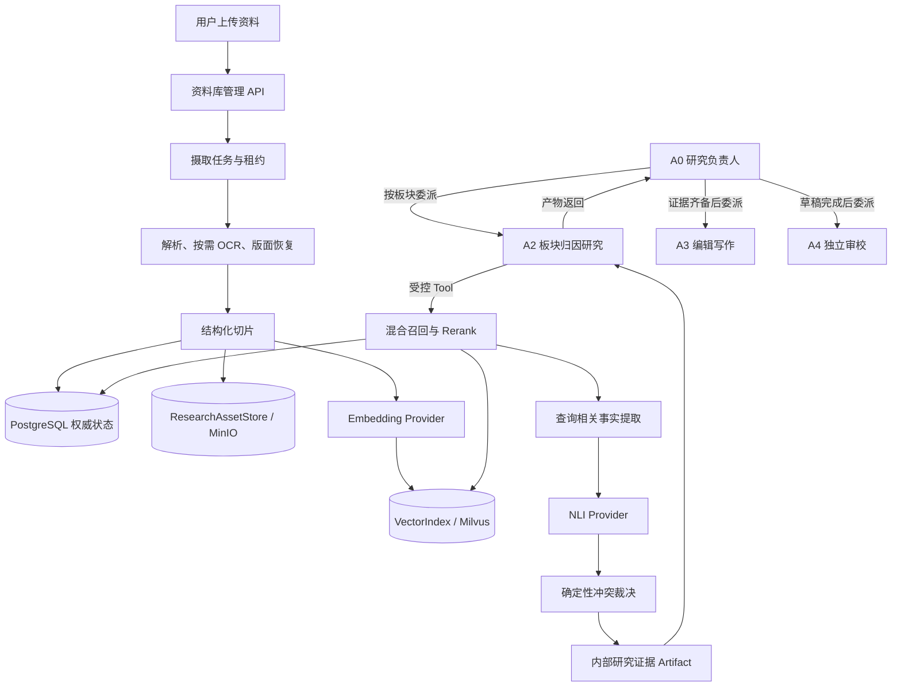

# SectorPulse 全局内部研究资料库 RAG 设计

日期：2026-09-17  
状态：设计已确认，尚未实施  
适用范围：SectorPulse A0–A4 父子多 Agent 平台

## 1. 摘要

本设计为 SectorPulse 增加一个全局内部研究资料库。用户可以上传 PDF、扫描 PDF、Markdown、TXT 和历史文章，系统完成解析、按需 OCR、结构化切片、Embedding 与 Milvus 混合索引。A2 板块归因研究 Agent 通过受预算约束的 Tool 检索资料，A3/A4 只能读取 A2 已接纳并形成 ArtifactRef 的证据，不能直接访问向量库。

方案采用“检索时事实化的证据型混合 RAG”：先进行 Dense 与 BM25 混合召回，再进行融合和 Rerank；只从 Top-N 候选中提取与当前问题相关的事实；将事实按主体、属性或关系、适用时间归组；只对同主题事实调用 NLI Provider；最后由确定性规则根据状态、明确版本、时间、来源权重和证据质量解决冲突。无法自动解决的冲突必须保留双方来源并标记为 `UNRESOLVED`，A3 不得写成确定性结论。

PostgreSQL 是权威状态源，MinIO 是默认原始文件与派生资产存储，Milvus 是可重建的派生检索索引。MinIO、Milvus、Embedding、Reranker、NLI、OCR 和视觉解析都通过可插拔接口接入。

## 2. 目标

1. 建立单一全局内部研究资料库，支持内部研报、PDF、Markdown、TXT 和历史文章。
2. 保留从检索结果到上传原文件的完整来源定位，包括文档、版本、页码、章节和页面区域。
3. 支持 Dense 与 BM25 混合召回、Rerank、查询相关事实提取和 NLI 冲突检测。
4. 处理同一文档的明确版本替换，以及独立文档之间的事实冲突。
5. 将 RAG 作为受控 Tool 接入 A2，不让 Agent 直接访问 Milvus、PostgreSQL、MinIO 或文件系统。
6. 允许替换对象存储、向量库及各类模型 Provider，而不改变上层 Agent 协作逻辑。
7. 支持失败恢复、幂等重试、租约接管、软删除、恢复、重建索引和完整调用审计。
8. 默认使用 Fixture 与临时测试资源验证；真实 Provider 只在显式授权和预算约束下验收。

## 3. 非目标

第一版不包含：

- 自动猜测两份独立文档是否是同一文档的新旧版本；
- 解析和维护源文档内部引用的公告、新闻、财报等二级来源图谱；上传原文档本身就是本系统的最初始来源；
- 全库永久事实图谱；
- 图片向量、以图搜图或多模态向量检索；
- 自动打开或抓取文档中的 URL；
- Agent 自主上传、删除、恢复、确认版本关系或调整来源权重；
- 多租户或团队权限隔离；
- 自动发布文章或替代人工批准；
- 将模型隐藏思考过程保存为审计数据。

## 4. 已确认的关键决策

| 主题 | 决策 |
| --- | --- |
| 资料库范围 | 第一版为单一全局资料库 |
| 文档版本 | 用户明确选择“新文档”或“已有文档的新版本” |
| 误传新文档 | 不在上传阶段自动猜版本；在检索阶段检测事实冲突 |
| 检索方式 | Milvus Dense + BM25，融合后使用 Reranker |
| 事实处理 | 只在 Rerank 后，从 Top-N 中按当前问题提取相关事实 |
| 冲突检测 | 同主题事实归组后调用可插拔 NLI API Provider |
| 冲突裁决 | 状态、明确版本、适用时间、来源权重、证据质量、相关性 |
| 无法裁决 | 标记 `UNRESOLVED`，A2 明示分歧，A3 禁止确定性表达 |
| 对象存储 | MinIO 为默认实现，业务层依赖可插拔 `ResearchAssetStore` |
| 向量存储 | Milvus 为默认实现，业务层依赖可插拔 `VectorIndex` |
| 模型组件 | Embedding、Reranker、NLI、OCR、Vision 全部可插拔 |
| PDF OCR | 原生文本优先，页面无文本或质量过低时按页 OCR |
| 图表输入 Agent | 默认只给结构化文本描述和来源；不把原图放入常规 Agent 上下文 |
| 删除 | 立即退出检索，保留期后物理清理；审计记录长期保留 |
| Agent 权限 | A2 可以检索；A3/A4 只读取已经形成引用的 Artifact |

## 5. 总体架构



### 5.1 职责边界

- **PostgreSQL**：文档、版本、状态、chunk 权威元数据、摄取任务、Outbox、检索审计和冲突裁决记录。
- **ResearchAssetStore**：原始文件、规范化文档、页面图片、图表裁剪和其他大型派生资产。默认实现是 MinIO。
- **VectorIndex**：Dense、BM25、标量过滤和派生索引生命周期。默认实现是 Milvus。
- **摄取服务**：校验、解析、OCR、版面恢复、切片、Embedding、索引校验和发布。
- **检索服务**：查询准备、混合召回、融合、Rerank、父块扩展、事实提取、NLI 和冲突裁决。
- **Agent**：A2 进行研究判断，A3 写作，A4 审校。Agent 不承担确定性存储、索引和权限工作。
- **用户**：上传资料、指定新文档或新版本、删除、恢复、设置来源治理信息和最终审核。

## 6. 可插拔接口

业务层不得直接依赖 MinIO SDK、Milvus SDK 或特定模型客户端。建议定义以下端口：

```python
class ResearchAssetStore(Protocol):
    def put(self, *, key: str, content: BinaryIO, metadata: AssetMetadata) -> AssetRef: ...
    def get(self, *, key: str) -> BinaryIO: ...
    def stat(self, *, key: str) -> AssetStat: ...
    def delete(self, *, key: str) -> None: ...
    def create_download_grant(self, *, key: str, expires_in_seconds: int) -> DownloadGrant: ...

class VectorIndex(Protocol):
    def stage(self, *, generation: str, records: Sequence[VectorRecord]) -> None: ...
    def verify(self, *, generation: str, expected_ids: set[str]) -> IndexVerification: ...
    def publish(self, *, generation: str) -> None: ...
    def search(self, query: HybridQuery) -> Sequence[VectorHit]: ...
    def delete_generation(self, *, generation: str) -> None: ...

class EmbeddingProvider(Protocol):
    def embed_documents(self, texts: Sequence[str]) -> Sequence[Embedding]: ...
    def embed_query(self, text: str) -> Embedding: ...

class RerankerProvider(Protocol):
    def rerank(self, *, query: str, candidates: Sequence[RerankCandidate]) -> Sequence[RerankScore]: ...

class NliProvider(Protocol):
    def classify(self, *, premise: str, hypothesis: str, context: NliContext) -> NliDecision: ...

class OcrProvider(Protocol):
    def recognize_page(self, image: BinaryIO) -> OcrPage: ...

class VisionDocumentProvider(Protocol):
    def analyze_region(self, image: BinaryIO, *, region_type: str) -> VisionBlock: ...
```

Provider 的配置、超时、重试、预算、调用审计和密钥处理遵循现有 Provider 装配方式。NLI 使用独立 API Provider 和独立模型配置，不能与 Agent 对话模型隐式绑定。

## 7. 文档摄取流程

### 7.1 上传入口

用户明确选择：

1. 上传为新文档；或
2. 上传为某个已有文档的新版本。

系统只使用文件 SHA256 处理完全相同上传请求的幂等性，不利用标题、作者、Embedding 或全文相似度自动猜测版本关系。

上传请求创建逻辑文档和版本记录，将原文件写入 `ResearchAssetStore`，随后异步创建摄取任务。原始文件是重新解析和重建索引的最终依据，不能被规范化文本替代。

### 7.2 摄取状态机

```text
RECEIVED
  → VALIDATING
  → PARSING
  → NORMALIZING
  → CHUNKING
  → EMBEDDING
  → INDEXING
  → VERIFYING
  → PUBLISHED
```

任一步骤可进入：

```text
RETRYABLE_FAILED
PERMANENT_FAILED
CANCELLED
```

每个任务记录 `worker_id`、`lease_expires_at` 和 `attempt_id`。只有租约过期后其他 worker 才能接管；接管生成新的 attempt；旧 attempt 的模型、索引或发布迟到结果不得覆盖当前状态。

这里的 `PUBLISHED` 是摄取任务的终态，不是文档版本状态。摄取发布成功后，文档版本状态为 `ACTIVE`；Milvus 实体使用独立的 `index_state = PUBLISHED`。三类状态必须使用不同枚举，避免相互混用。

### 7.3 PDF 原生文本提取

默认 `PdfTextExtractor` 可使用 PyMuPDF 一类库读取每页的字符、行、block、字体、字号、坐标和页面尺寸。它产出的是带布局信息的中间结构，不是简单的大段字符串。

原生 PDF 一般不能直接提供可靠的语义标题、段落、多栏阅读顺序或复杂表格结构，因此还需经过独立、可插拔的 `LayoutParser` 和 `DocumentNormalizer`。

```text
PDF 文件
  → PdfTextExtractor：字符、字体、坐标、初步 block
  → LayoutParser：标题、段落、多栏、表格和阅读顺序
  → DocumentNormalizer：清理、统一和质量检查
  → DocumentBlock[]
```

### 7.4 按页 OCR

页面出现以下情况时才调用 OCR：

- 没有原生文本层；
- 有效字符数量低于阈值；
- 乱码比例超过阈值；
- 字符位置或阅读顺序明显异常；
- 页面主要内容是扫描图像。

基础 OCR Provider 返回文字、坐标和置信度；LayoutParser 将其组合成行、段落、标题、列表和表格。高级文档 OCR 如果已经输出结构化版面，则适配器直接映射为统一 `DocumentBlock`，DocumentNormalizer 仍负责清理和校验。

```text
基础 OCR：页面图像 → OcrProvider → LayoutParser → DocumentNormalizer
高级 OCR：页面图像 → OcrProvider（含版面）→ DocumentNormalizer
```

OCR 结果记录 Provider、模型版本、页面、坐标和置信度。

### 7.5 统一 DocumentBlock

```text
block_id
block_type: heading | paragraph | list | table | chart | image | figure_caption | formula | code
text
heading_path
page_number / page_range
block_order
bounding_box
extraction_method: native | ocr | parser_derived | vision_derived
extraction_confidence
source_asset_ref
```

### 7.6 Markdown

- 按标题层级建立 `heading_path`；
- 段落、列表、表格、代码块分别形成结构块；
- 表格和代码块不从中间盲切；
- 过大的表格按行组拆分，并重复表头、单位和注释；
- 保留源字符范围，确保引用可以定位。

### 7.7 TXT

- 检测编码并规范化换行和空白；
- 优先按段落和句子边界分块；
- 无明显结构时才使用长度窗口；
- 记录规范化前后哈希和源字符范围。

### 7.8 表格

表格同时保存结构化数据、检索文本表示、页码、坐标、标题、单位、注释和来源。

```json
{
  "block_type": "table",
  "title": "公司营收情况",
  "columns": ["年份", "营收", "同比"],
  "rows": [["2025", "120 亿", "15%"], ["2026", "138 亿", "15%"]],
  "unit": "亿元",
  "page_number": 18
}
```

用于 Dense 与 BM25 的文本表示：

```text
表格：公司营收情况
单位：亿元
2025 年：营收 120 亿，同比 15%。
2026 年：营收 138 亿，同比 15%。
```

大表格按行组切片，每段重复表名、列名、单位和注释，不能把表头与数据行分开。

### 7.9 图表

基础层提取图题、图例、坐标轴文字、单位、脚注和附近正文。增强层裁剪图表区域，交给 `VisionDocumentProvider` 生成结构化描述。

Agent 默认只接收结构化文本描述、可信度和来源定位，不接收原图。原图保存在对象存储中，用于人工核对、重新解析和受控复核。

视觉派生的精确数值只有在达到阈值并通过格式和一致性校验时，才可以成为候选证据。低置信度内容标记 `requires_verification = true`，不能单独支撑确定性结论。

### 7.10 普通图片

- 有原始图题或说明时，将说明写入文本索引；
- 配置视觉 Provider 时，可索引模型派生描述，但必须标记来源；
- 无图题且无可靠描述时，只保存图片与来源定位，不进入文本向量索引；
- Logo、背景图和装饰图片直接排除。

### 7.11 公式

能够可靠提取为 Unicode、MathML 或 LaTeX 时，将公式名称、公式、变量说明和附近正文组成一个公式 chunk。只有截图且无法可靠识别时，仅保存截图和定位，不生成猜测文本。计算公式结果属于确定性计算 Tool 的职责，不由 RAG 检索层推导。

## 8. 结构化切片

采用“子块检索、父块阅读”：

- 子 chunk 目标约 `300–500 tokens`，软上限约 `700 tokens`；
- 相邻文本重叠约 `50–80 tokens`；
- 标题、表头和单位等结构上下文直接复制，而不是只依赖重叠；
- 父 chunk 通常是完整章节或连续页面片段，约 `800–1500 tokens`；
- Milvus 检索子 chunk，命中后按 `parent_chunk_id` 有界展开上下文；
- 表格、代码块、公式和图表描述按照自身结构切分；
- 每个 chunk 使用确定性 `content_hash` 和幂等 ID；
- 每个 chunk 保存文档、版本、页码、章节、源 block 和原文范围。

不在摄取阶段抽取全库事实。事实只在查询后从小规模 Top-N 中按当前问题临时提取。

## 9. 存储设计

### 9.1 PostgreSQL 表

建议增加：

```text
research_documents
research_document_versions
research_document_assets
research_chunks
research_ingestion_jobs
research_index_outbox
research_retrieval_audits
research_conflict_decisions
```

`research_documents`：

```text
document_id
title
document_type
author
institution
source_weight
current_version_id
visibility_scope       预留，第一版固定 GLOBAL
owner_id               预留
access_tags            预留
created_at
deleted_at
purge_after
```

`research_document_versions`：

```text
document_version_id
document_id
version_number
status
published_at
effective_from
effective_to
uploaded_at
original_file_hash
parser_version
chunking_policy_version
ocr_provider / ocr_model_version
embedding_provider / embedding_model_version
index_generation
expected_chunk_count
indexed_at
```

版本状态：

```text
PROCESSING    正在处理，不可检索
ACTIVE        当前有效，可检索
SUPERSEDED    被明确新版本替代，默认不可检索
ARCHIVED      人工归档，默认不可检索
FAILED        摄取失败，不可检索
DELETED       软删除，立即退出检索
PURGED        正文和索引已物理清理
```

`research_chunks`：

```text
chunk_id
document_id
document_version_id
parent_chunk_id
chunk_type
content
content_hash
page_start / page_end
section_path
source_block_ids
source_spans
content_origin
confidence
requires_verification
embedding_status
created_at
```

### 9.2 对象存储

默认实现为 MinIO，但业务层只依赖 `ResearchAssetStore`。未来可替换 S3、OSS、COS 或内部对象存储。

对象键示例：

```text
original/{document_id}/{version_id}/source.pdf
normalized/{document_id}/{version_id}/document.json
pages/{document_id}/{version_id}/page-001.png
regions/{document_id}/{version_id}/chart-007.png
```

数据库保存逻辑对象键、SHA256、MIME 类型、大小和创建时间，不保存大型二进制。对象键由系统生成，不能使用用户文件名直接拼接。

### 9.3 Milvus Collection

第一版使用一个全局 collection，例如：

```text
internal_research_chunks_v1
```

主要字段：

```text
pk                        主键；派生值 = chunk_id + ":" + index_generation
chunk_id                  标量字段（业务块 ID，单个 generation 内唯一）
index_generation          标量字段；重建期间新旧 generation 并存
document_id
document_version_id
parent_chunk_id
index_state: STAGED | PUBLISHED
chunk_type
document_type
institution
published_at
effective_from / effective_to
source_weight
content_origin
confidence
requires_verification
content                   BM25 文本字段
dense_vector              Dense 向量
```

Milvus 中不存储唯一权威业务状态。它可以保存 `index_state` 来减少无效候选，但最终可见性必须由 PostgreSQL 复核。

### 9.4 可重建性

Milvus 和规范化派生资产都必须可以从 PostgreSQL 元数据与 MinIO 原文件重建。任何代码不得把“Milvus 查得到”当成文档存在或有效的唯一依据。

## 10. 索引写入与原子可见性

本设计不要求 PostgreSQL 与 Milvus 之间的分布式事务，而采用“先构建派生索引、校验、最后发布、查询复核”。

```text
1. PostgreSQL 版本保持 PROCESSING
2. 全部 chunk 写入 Milvus，index_state = STAGED
3. 校验预期数量、ID 集合、向量维度和必需元数据
4. 将该 generation 的 Milvus 记录发布为 PUBLISHED
5. 再次确认没有缺失或 STAGED chunk
6. PostgreSQL 条件更新 PROCESSING → ACTIVE
7. 文档正式可检索
```

Milvus 的批量发布如果不是原子的，也不会导致半份文档可见，因为 PostgreSQL 仍为 `PROCESSING`。检索服务对 Milvus 候选的 `document_version_id` 执行 PostgreSQL 批量复核，只保留 `ACTIVE`。

新版本处理期间旧版本保持 `ACTIVE`。新版本完全准备好后，在一个 PostgreSQL 事务中：

```text
旧版本 ACTIVE → SUPERSEDED
新版本 PROCESSING → ACTIVE
document.current_version_id → 新版本
```

旧版本 Milvus 实体异步删除；删除前即使被召回，也会在 PostgreSQL 复核时丢弃。检索阶段应适当超额召回，降低失效候选占据 Top-K 造成的召回损失。

## 11. 检索流程

### 11.1 Tool 输入

A2 使用 `search_internal_research`：

```json
{
  "question": "储能板块近期上涨是否与海外需求改善有关？",
  "sector": "储能",
  "companies": [],
  "time_range": {"from": "2026-01-01", "to": "2026-09-17"},
  "document_types": ["report", "historical_article"],
  "include_unverified_leads": false
}
```

Agent 不能直接传入任意 Milvus filter、collection 名或 Top-K。所有上限由服务配置和预算决定。

### 11.2 查询准备

查询准备提取：

- 核心检索语句；
- 公司、板块、主题实体；
- 时间约束；
- 文档类型；
- 行业缩写和受限同义词。

查询改写可以使用独立 Provider，但必须保留原问题，限制扩展数量，并记录改写版本。改写不能改变问题方向。

### 11.3 混合召回

建议初始默认值：

```text
Dense Top 40
BM25 Top 40
       ↓
RRF 融合、去重
       ↓
候选 Top 50
       ↓
Cross-encoder Reranker
       ↓
Top 12
       ↓
父块展开和来源多样性控制
```

这些数量均为配置项。

- Dense 负责语义近似表达；
- BM25 负责公司名、产品名、政策编号和专业术语；
- RRF 避免直接比较不同量纲分数；
- Reranker 对问题和候选文本统一打分；
- 相同文档和章节的高度重叠 chunk 合并或限额；
- 父块展开受长度限制；
- Milvus 候选返回后，PostgreSQL 批量复核 `ACTIVE` 状态。

Milvus 官方文档提供全文/BM25、混合和多向量检索能力，实施时应按所选 Milvus 版本核对具体 schema 与 API：

- <https://milvus.io/docs/full-text-search.md>
- <https://milvus.io/docs/multi-vector-search.md>
- <https://milvus.io/docs/hybrid_search_with_milvus.md>

## 12. 查询相关事实提取

只从 Rerank 后的 Top-N 中提取与当前问题有关的事实。一个 chunk 可以提取零个、一个或多个事实，但不会把 chunk 的全部内容都永久事实化。

```json
{
  "claim_id": "claim_runtime_01",
  "statement": "海外储能订单在 2026 年第二季度明显增长",
  "subject": "海外储能订单",
  "predicate": "增长情况",
  "object": "明显增长",
  "valid_time": {"from": "2026-04-01", "to": "2026-06-30"},
  "qualifiers": ["第二季度"],
  "source_chunk_id": "chunk_123",
  "source_span": {"start": 86, "end": 112},
  "extraction_confidence": 0.91
}
```

约束：

- `source_span` 必须精确匹配 chunk 原文；
- 原文无法支持的事实直接拒绝；
- 提取结果默认只属于当前检索运行；
- 最终被采用或进入冲突判断的事实可以随审计记录保存；
- 不保存模型隐藏思考过程。

## 13. 事实归组与 NLI

候选事实按以下条件归组：

```text
主体相同或实体归一后相同
+ 属性/关系相同
+ 时间范围重叠或存在可比较关系
```

只有同组中来自不同版本、不同来源或结论方向可能不一致的事实才进入 NLI。不会对所有事实执行笛卡尔积比较。

NLI 接口返回：

```text
entailment | contradiction | neutral | uncertain
confidence
provider/model_version
```

输入包含两条规范化事实、必要的原文上下文和时间限定。NLI 只判断语义关系，不决定采用哪一条事实。低于阈值的结果是 `uncertain`，不得触发自动覆盖。NLI API 失败时结果标记 `CHECK_FAILED`，不能假装没有冲突。

## 14. 确定性冲突裁决

检测到冲突后按以下优先级处理：

1. **状态**：`ACTIVE` 优先于 `SUPERSEDED`、`ARCHIVED`、`DELETED`。
2. **明确版本**：同一 `document_id` 下的新版本优先于旧版本。
3. **适用时间**：优先匹配问题指定时间；不同时间的事实可能不是冲突。
4. **来源权重**：由资料治理配置，不由 Agent 临时修改。
5. **证据质量**：原生文本和可靠表格优先于低置信度 OCR 或视觉派生内容。
6. **相关性**：只用于以上规则相同时排序，不能独自消灭独立有效来源间的冲突。

时间字段必须区分：

```text
published_at     文档声明的发布日期
effective_time   事实适用时间
uploaded_at      用户上传时间，只用于审计
```

裁决结果：

```text
RESOLVED        规则选出有效事实
NOT_CONFLICT    时间或条件不同，实际上不冲突
UNRESOLVED      独立有效来源相互矛盾，规则无法判断
CHECK_FAILED    事实提取或 NLI 未完成
```

`UNRESOLVED` 必须保留双方事实和来源。A2 必须明确描述分歧；A3 不得写成确定性结论；A4 发现违规表述时必须要求修订。

## 15. Agent、Tool、Artifact 与 Skill

### 15.1 A0

A0 不直接查询 Milvus。它负责给 A2 分配研究问题和预算、收集 A2 Artifact、判断证据是否齐备，并将允许的 ArtifactRef 传给 A3/A4。

### 15.2 A2

A2 是唯一具有 RAG 检索权限的专业 Agent，增加：

`search_internal_research`

- 执行受控混合检索、Rerank、事实提取和冲突处理；
- 返回有界的候选证据摘要；
- 每项结果带来源、证据等级、冲突状态和检索结果 ID。

`inspect_research_source`

- 只能检查当前任务中此前检索到的候选；
- 返回受长度限制的原文片段、父块上下文和来源定位；
- 不能通过任意 chunk ID 越权读取全库；
- 不返回 MinIO 凭证、对象键或内部下载地址。

A2 提交 `internal_research_evidence` Artifact：

```json
{
  "kind": "internal_research_evidence",
  "claims": [
    {
      "statement": "海外储能需求在第二季度改善",
      "stance": "supporting",
      "conflict_status": "RESOLVED",
      "source_refs": [
        {
          "document_id": "doc_12",
          "document_version_id": "docv_42",
          "chunk_id": "chunk_123",
          "page_start": 18,
          "page_end": 18
        }
      ]
    }
  ]
}
```

### 15.3 A3

A3 不获得 RAG 检索 Tool，只能通过 `inspect_artifacts` 读取 A2 已接纳的证据。它不能扩大研究范围，引用必须来自 `source_refs`，不能将 `UNRESOLVED`、`CHECK_FAILED` 或唯一的 `requires_verification` 证据写成确定性结论。

### 15.4 A4

A4 不执行开放式 RAG 检索。它检查草稿事实、A2 证据、来源引用、冲突状态和核验要求。确定性审校 Tool 应检查：

- 关键事实是否有 `source_ref`；
- 引用版本是否仍有效；
- 是否把 `UNRESOLVED` 写成确定事实；
- 是否将待核验派生证据作为唯一依据；
- 页码和 chunk 是否仍能定位。

### 15.5 Skill

新增只读受控 Skill：

- `internal-research-retrieval`：指导 A2 形成检索问题、选择时间范围、检查原文、理解证据等级和处理冲突。
- `internal-evidence-writing`：指导 A3/A4 使用内部证据、表达未解决冲突、区分原文与派生描述。

Skill 不包含数据库、Milvus 或 MinIO 凭证，也不改变角色 Tool 白名单。

## 16. 文档版本与维护

### 16.1 新文档与新版本

新文档创建新的 `document_id`。新版本必须由用户指定已有 `document_id`。新版本发布失败时，旧版本继续保持 `ACTIVE`。

把更新材料误传为新文档时，系统不会自动改关系。两个独立文档如果陈述冲突事实，在检索阶段由 NLI 和确定性规则处理；无法解决则保留分歧。

### 16.2 技术重建不是内容版本

解析器、OCR、切片、Embedding 或图表识别升级时，只创建新的派生 `index_generation`，不增加文档业务版本。重建成功后切换 generation，失败时继续使用旧 generation。

### 16.3 软删除、恢复和清理

删除流程：

1. PostgreSQL 标记 `DELETED`；
2. 检索立即过滤；
3. Outbox 异步删除 Milvus 实体；
4. MinIO 原文件和派生资产进入保留期；
5. `purge_after` 到期后物理删除；
6. 保留不含正文的审计记录。

默认保留期建议 30 天，实际值配置化。保留期内可以恢复；Milvus 实体已删除时按权威 chunk 重建。物理清理后状态为 `PURGED`，不可恢复。MinIO 生命周期规则不能绕过 PostgreSQL 状态直接删除业务资产。

### 16.4 索引维护

定期任务：

- 比对 PostgreSQL 应索引 chunk 与 Milvus 实体；
- 删除失效、替代或孤立向量；
- 重试 Outbox；
- 检查向量维度和 schema；
- 检查 MinIO 对象哈希、大小和数据库记录；
- 统计空召回、重复召回和低相关性结果；
- 对长期失败任务告警。

### 16.5 Embedding 升级

```text
alias → chunks_v1
后台构建 chunks_v2
离线评测与影子查询
原子切换 alias → chunks_v2
保留 v1 回滚窗口
最终清理 v1
```

不同向量维度或模型不能混入同一向量字段。

## 17. 缓存

缓存键至少包含：

```text
query_fingerprint
corpus_generation
filters
embedding_model_version
reranker_model_version
nli_model_version
conflict_policy_version
```

文档发布、删除、恢复或来源权重变更必须推进 `corpus_generation`，防止失效证据继续命中缓存。

## 18. 安全

### 18.1 文件安全

- MIME、扩展名和文件头联合校验；
- 限制文件大小、页数、解析时间、解压后大小和图片像素；
- 可插拔恶意文件扫描器在解析前运行；
- 加密 PDF 返回需要密码，不尝试破解；
- 不执行 PDF JavaScript、嵌入附件或外部链接；
- 解析器运行在受限 worker 中；
- MinIO bucket 私有，对象键由系统生成。

### 18.2 文档提示注入

所有上传内容均为不可信数据。文档中的“忽略系统指令”“调用工具”“泄露其他资料”等文字只能视为证据内容。

- Tool 返回稳定 JSON Schema 和明确证据边界；
- Prompt 明确禁止执行文档内指令；
- Tool/Skill 权限由角色工厂决定，文档不能改变权限；
- 文档 URL 默认不访问；
- 检索结果不包含凭证、内部对象键或配置。

### 18.3 MinIO 访问

- 后端使用最小权限服务账号；
- 用户查看原文时，后端校验状态后签发短时下载授权或流式返回；
- Agent Tool 不接收预签名 URL；
- 删除通过 `ResearchAssetStore` 完成；
- MinIO 不作为文档状态事实源。

## 19. 失败恢复与幂等

- 每个阶段使用确定性输入指纹；
- Provider 缓存键包含 Provider、模型和配置版本；
- Milvus 写入以 `chunk_id + index_generation` 幂等；
- Outbox 事件可以重放；
- 只有持有有效租约和当前 attempt 的 worker 能推进状态；
- 最终发布使用 PostgreSQL 条件更新；
- 取消任务后清理未发布的 STAGED 数据；
- 旧 attempt 的 OCR、Embedding、NLI、索引和 Artifact 迟到结果全部拒绝。

## 20. 审计与可观测性

### 20.1 检索审计

保存：

```text
retrieval_id
run_id / task_id / attempt_id / role
原始问题、查询指纹和结构化过滤
corpus_generation
各 Provider 与模型版本
Dense/BM25 候选及分数
融合和 Rerank 顺序
父块展开记录
候选事实和 source_span
NLI 关系和置信度
冲突裁决规则和结果
最终返回证据 ID
耗时、调用次数、token 和金额
```

普通日志不写完整文档正文，不保存隐藏思考过程。

### 20.2 指标

- 摄取成功率和阶段耗时；
- OCR 页面占比和低置信度比例；
- chunk 数量与长度分布；
- Provider 错误率、延迟和成本；
- Dense/BM25 候选贡献率；
- 空召回率、重复率和来源多样性；
- 冲突发现、自动解决、未解决和失败比例；
- 失效文档误返回次数；
- PostgreSQL、MinIO、Milvus 一致性差异。

### 20.3 告警

- `DELETED`、`SUPERSEDED`、`PROCESSING` 进入最终证据；
- 索引和数据库长期不一致；
- 摄取租约反复过期；
- Provider 错误率超阈值；
- A3 将 `UNRESOLVED` 写成确定结论；
- 物理清理失败或超过保留期。

## 21. 配置

建议配置前缀：

```dotenv
SECTOR_PULSE_RAG_ENABLED=false

SECTOR_PULSE_RAG_VECTOR_PROVIDER=milvus
SECTOR_PULSE_RAG_MILVUS_URI=
SECTOR_PULSE_RAG_MILVUS_TOKEN=
SECTOR_PULSE_RAG_MILVUS_COLLECTION=internal_research_chunks_v1

SECTOR_PULSE_RAG_ASSET_PROVIDER=minio
SECTOR_PULSE_RAG_MINIO_ENDPOINT=
SECTOR_PULSE_RAG_MINIO_ACCESS_KEY=
SECTOR_PULSE_RAG_MINIO_SECRET_KEY=
SECTOR_PULSE_RAG_MINIO_BUCKET=

SECTOR_PULSE_RAG_EMBEDDING_PROVIDER=
SECTOR_PULSE_RAG_EMBEDDING_MODEL=
SECTOR_PULSE_RAG_RERANKER_PROVIDER=
SECTOR_PULSE_RAG_RERANKER_MODEL=
SECTOR_PULSE_RAG_NLI_PROVIDER=
SECTOR_PULSE_RAG_NLI_MODEL=
SECTOR_PULSE_RAG_OCR_PROVIDER=
SECTOR_PULSE_RAG_OCR_MODEL=
SECTOR_PULSE_RAG_VISION_PROVIDER=
SECTOR_PULSE_RAG_VISION_MODEL=
```

每类 Provider 独立配置超时、最大重试、批大小、并发、单次预留费用和日预算。密钥只来自运行环境，不进入数据库、Artifact、日志或 Agent 上下文。

## 22. 测试与评测

### 22.1 黄金数据集

至少覆盖：

- 原生 PDF、多栏、页眉页脚；
- 扫描 PDF 和部分页面 OCR；
- Markdown 表格、代码块和嵌套标题；
- TXT 编码和无结构文本；
- 明确新旧版本；
- 可解决和不可解决冲突；
- 表格、图表和视觉派生描述；
- 删除、恢复、重建；
- 文档提示注入；
- 中文简称、行业术语和政策编号。

样本包含：

```text
question
expected_relevant_chunk_ids
expected_source_document_ids
expected_conflict_status
expected_selected_claims
forbidden_chunk_ids
```

### 22.2 检索指标

```text
Recall@K
MRR
nDCG@K
Reranker Top-N 命中率
来源多样性
重复 chunk 比例
无效版本泄漏率
引用定位准确率
```

强制门禁：

```text
DELETED/SUPERSEDED/PROCESSING 泄漏率 = 0
chunk 到原文件定位成功率 = 100%
未解决冲突被写成确定事实 = 0
文档提示注入导致 Tool 越权 = 0
```

### 22.3 事实与 NLI

事实提取评测原文支持率、source span 匹配率、主体/关系/客体/时间准确率、不相关误提取率和多事实遗漏率。

NLI 数据集覆盖 `ENTAILMENT`、`CONTRADICTION`、`NEUTRAL` 和 `UNCERTAIN`，并重点包含时间不同、单位不同、条件范围不同、预测与事实差异、主体混淆和 OCR 错字。

冲突裁决器必须使用表驱动单元测试穷举优先级，不依赖真实模型。

### 22.4 测试分层

```text
单元测试
  状态机、切片、冲突规则、缓存键、幂等 ID、Tool Schema

契约测试
  Embedding、Reranker、NLI、OCR、Vision、ResearchAssetStore、VectorIndex

集成测试
  PostgreSQL + MinIO + Milvus
  上传到检索、失败接管、新版本替换、删除恢复、索引重建

Agent 测试
  A2 使用 RAG Tool
  A3 无法直接检索
  A3 正确表达冲突
  A4 拦截无证据和错误确定性结论
```

默认回归使用 Fixture Provider 和临时资源，不调用真实模型。真实 Provider 通过显式开关单独验收，并设置调用次数、金额和 deadline。PostgreSQL、MinIO、Milvus 必须使用专用测试实例、bucket 和 collection。

## 23. 分阶段实施

### 阶段 1：领域与存储基础

- 领域模型和状态机；
- PostgreSQL Schema 与 Repository；
- `ResearchAssetStore` 和 MinIO 适配器；
- 上传、软删除和摄取任务租约；
- Fixture/内存适配器。

### 阶段 2：解析与切片

- PDF/Markdown/TXT 解析；
- 按页 OCR；
- LayoutParser 与 DocumentNormalizer；
- 表格、图表、图片和公式处理；
- 父子 chunk 与来源定位。

### 阶段 3：向量索引

- Embedding Provider；
- Milvus Dense + BM25；
- Outbox；
- STAGED/PUBLISHED 双层门禁；
- 原子可见性和索引重建。

### 阶段 4：检索与冲突

- 查询准备；
- Dense/BM25/RRF/Reranker；
- 查询相关事实提取；
- NLI Provider；
- 冲突裁决与审计。

### 阶段 5：Agent 集成

- A2 两个受控 Tool；
- ArtifactRef 和证据产物；
- A3/A4 权限与确定性规则；
- 两个受控 Skill；
- 预算、deadline 和迟到结果保护。

### 阶段 6：治理与验收

- 管理 API；
- 恢复、清理和维护任务；
- 可观测性和告警；
- 黄金评测集；
- 完整离线回归和真实依赖合同验收。

每个阶段使用测试先行；完成后运行专项测试、Ruff、Mypy 和完整离线回归。单阶段通过不得描述为整个 RAG 系统完成。

## 24. 验收标准

1. 用户可以上传支持格式，查看处理状态，并从引用定位回原文件页码和区域。
2. 新文档在全部 chunk 完成并验证前不会部分可见。
3. 新版本失败不会影响旧版本；成功时完成原子替换。
4. 删除文档立即退出检索，保留期内可恢复，过期后可审计地清理。
5. 混合检索、Rerank、事实提取、NLI 和冲突裁决均有独立测试和指标。
6. A2 能使用内部资料；A3/A4 不能直接查询向量库。
7. 每条最终采用证据包含文档、版本、chunk、页码或章节定位。
8. 无法解决的冲突不会被写成确定性事实。
9. 文档内容不能扩大 Agent Tool 权限或触发外部 URL。
10. MinIO、Milvus 和模型 Provider 可以通过接口替换。
11. Fixture 测试不依赖真实外部服务；真实测试只使用专用测试资源。
12. 所有模型和工具调用受预算、deadline、attempt 所有权和审计约束。

## 25. 风险与缓解

| 风险 | 缓解 |
| --- | --- |
| PDF 版面恢复错误 | 保留页码、坐标和原图；解析质量门禁；可替换 LayoutParser |
| OCR 错字产生伪事实 | 保存置信度；低质量内容待核验；NLI 评测覆盖 OCR 错误 |
| 图表视觉模型编造数值 | 原图保留；派生标记；阈值和一致性校验；不得单独支撑结论 |
| 失效向量占据 Top-K | Milvus 状态过滤、超额召回、PostgreSQL 复核、异步清理 |
| 独立来源无法裁决 | 返回 `UNRESOLVED`，A2/A3/A4 强制执行表达规则 |
| 模型升级改变结果 | 记录模型版本、影子评测、collection alias 和回滚窗口 |
| 文档提示注入 | 数据/指令隔离、固定 Tool Schema、角色白名单、禁止自动 URL |
| Provider 成本失控 | 独立预算、调用上限、batch、cache、deadline 和审计 |
| 对象存储绑定 | `ResearchAssetStore` 端口；MinIO 仅为默认适配器 |

## 26. 参考资料

- Milvus Full Text Search：<https://milvus.io/docs/full-text-search.md>
- Milvus Multi-Vector Hybrid Search：<https://milvus.io/docs/multi-vector-search.md>
- Milvus Hybrid Search：<https://milvus.io/docs/hybrid_search_with_milvus.md>
- Milvus Upsert：<https://milvus.io/docs/upsert-entities.md>
- Milvus Quickstart 与标量过滤：<https://milvus.io/docs/quickstart.md>
- Microsoft Advanced RAG：<https://learn.microsoft.com/en-us/azure/developer/ai/advanced-retrieval-augmented-generation>
